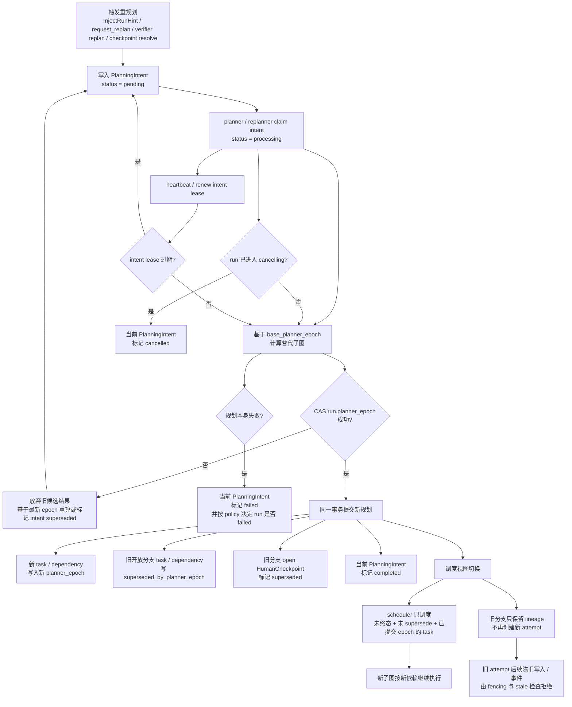

# Task-Oriented Orchestration Subsystem Plan

## Goal

在 Memoh 现有 User Bot 架构之外，实现一个独立的 `task-oriented orchestration subsystem`，使复杂任务能够被拆解为 DAG 任务图，由多个 `task-scoped worker runtime` 在隔离执行环境中协作完成，并由 Orchestrator 持续负责调度、验证、重规划、取消和人工介入。

该子系统与上层聊天语义解耦。上层负责：

- 发起任务
- 查询状态
- 处理 HITL：终止任务、添加提示、手动重试错误任务
- 订阅结果事件
- 将最终结果回传给用户

子系统内部只关心：

- `Run`
- `Task`
- `TaskAttempt`
- `TaskResult`
- `InputManifest`
- `WorkerProfile`
- `EnvResource`
- `EnvSession`
- `EnvBinding`
- `EnvSnapshot`
- `ActionRecord`
- `Artifact`
- `RunEvent`
- `Blackboard`
- `HumanCheckpoint`
- `ExperienceRecord`

---

## Confirmed Decisions

- `Postgres` 是唯一权威状态源
- `EnvSession` 有独立生命周期，可跨 task / attempt 复用
- `Executor` 与 `EnvManager` 严格分离
- 上层只通过 `OrchestrationClient` 与子系统交互

---

## Architecture

### Boundaries

1. `Interaction Plane`
  Memoh User Bot、tool 调用、结果回传。
2. `Control Plane`
  Orchestrator。负责 DAG、调度、验证、重规划、取消、恢复、HITL。
3. `Execution Plane`
  Worker Runtime + Executor Backend + Env Manager Backends。当前 worker 执行后端落在现有 containerd / workspace 能力之上，但控制层不感知底层细节。
4. `State Plane`
  Postgres 作为权威状态存储，NATS JetStream 负责事件分发，NATS KV 承载 blackboard 的运行期视图，Artifact Store 存放产物与快照。

### State Authority

这里的“权威状态源”指：

- 系统判断 `Run / PlanningIntent / Task / TaskAttempt / EnvSession / HumanCheckpoint` 当前真实状态时的唯一依据
- 系统判断 `TaskResult / Artifact metadata` 等 durable 输出内容时的唯一依据
- orchestrator 重启后用于恢复控制流的依据
- 审计、对账、冲突判定时的最终依据

对应约束：

- `Postgres` 保存事实状态和状态迁移
- `JetStream` 分为 fact ingress 和 committed outbox 两类分发通道；两者都不是权威状态源
- `NATS KV` 只保存 blackboard 的运行期视图
- Artifact Store 保存对象内容，artifact metadata 仍回写 `Postgres`

### Hard Separation Rules

- 核心领域模型中不出现 `Bot`, `Session`, `Channel`, `Persona` 作为一等抽象。
- `BotID`, `SessionID`, `MessageID` 只能出现在 source metadata / link table 中。
- `Worker Runtime` 不继承聊天平台、用户记忆、persona、contacts、send/reaction 等能力。
- `Executor` 是后端边界，不能让 orchestrator 直接依赖 containerd 细节。
- `Blackboard` 和 `Artifact` 是显式协作层，worker 间不能靠“互相聊天”共享状态。

---

## Repo Layout

新增以下入口和模块：

```text
cmd/orchestrator
cmd/workerd

internal/task
internal/orchestrationapi
internal/experience
internal/orchestrator
internal/orchestrator/planner
internal/orchestrator/scheduler
internal/orchestrator/verifier
internal/orchestrator/replanner
internal/orchestrator/hitl

internal/runtime/worker
internal/executor
internal/executor/containerd

internal/env
internal/env/browser
internal/env/desktop
internal/env/phone

internal/events
internal/blackboard
internal/artifacts
```

现有代码复用策略：

- 复用 `internal/agent` 的 model + tool loop 基础能力，但抽出 task-scoped `Agent Core`
- 复用 `internal/containerd` 和 `internal/workspace` 的容器基础设施
- 复用现有 tool provider 机制，但 worker runtime 使用独立 tool policy
- 不将 `internal/conversation/flow`、现有 `spawn/subagent`、bot session 语义作为编排层基础

---

## Core Domain Model

### Core Model Admission Rule

核心模型保持最小化。一个概念只有在满足以下条件时才进入核心领域模型：

- 有独立生命周期
- 有独立状态机或一致性约束
- 不是其他实体的纯视图或命名打包
- 需要被多个模块共享和持久化
- 缺少它会让调度、恢复、审计或权限边界变得含糊

当前应保持为一等实体的有：

- `Run`
- `Task`
- `TaskAttempt`
- `TaskResult`
- `InputManifest`
- `WorkerProfile`
- `EnvResource`
- `EnvSession`
- `EnvBinding`
- `EnvSnapshot`
- `ActionRecord`
- `Artifact`
- `RunEvent`
- `HumanCheckpoint`
- `ExperienceRecord`

当前不引入新的打包型抽象，例如：

- `TaskSpace`
- `WorkerSpace`
- `WorkerSessionGroup`

这类概念在现阶段更适合作为查询视图、命名约定或组合对象，而不是新的持久化主实体。

### Run

表示一次完整编排任务。

关键字段：

- `id`
- `lifecycle_status`
- `planning_status`
- `status_version`
- `planner_epoch`
- `root_task_id`
- `goal`
- `input`
- `output_schema`
- `tenant_id`
- `owner_subject`
- `control_policy`
- `created_by`
- `source_metadata`
- `terminal_reason`
- `created_at`
- `updated_at`
- `finished_at`

其中：

- `root_task_id` 必须在 run 创建事务中写入，并始终指向 eager-created 的 root task；不允许存在已持久化 run 但 `root_task_id` 为空的状态

### Task

表示任务图中的一个节点。

关键字段：

- `id`
- `run_id`
- `decomposed_from_task_id`
- `kind`
- `goal`
- `inputs`
- `planner_epoch`
- `superseded_by_planner_epoch`
- `worker_profile`
- `priority`
- `retry_policy`
- `verification_policy`
- `status`
- `status_version`
- `waiting_checkpoint_id`
- `waiting_scope`
- `latest_result_id`
- `ready_at`
- `blocked_reason`
- `terminal_reason`
- `blackboard_scope`
- `created_at`
- `updated_at`

### TaskAttempt

表示某个 task 的一次执行尝试。

关键字段：

- `id`
- `task_id`
- `run_id`
- `attempt_no`
- `executor_id`
- `worker_id`
- `status`
- `claim_epoch`
- `claim_token`
- `lease_expires_at`
- `last_heartbeat_at`
- `input_manifest_id`
- `park_checkpoint_id`
- `parked_at`
- `park_reason`
- `failure_class`
- `terminal_reason`
- `started_at`
- `finished_at`

### TaskResult

表示 task 的权威 durable 输出。

关键字段：

- `id`
- `run_id`
- `task_id`
- `attempt_id`
- `summary`
- `structured_output`
- `created_at`
- `updated_at`

其中：

- `task_id` 在 `orchestration_task_results` 中必须唯一，表示该 task 当前被接受的权威结果
- 重试如果产出新的被接受结果，必须在同一事务里替换 `Task.latest_result_id`
- blackboard 中的 `result.*` 只允许镜像这里的内容，不能成为唯一权威来源

### InputManifest

表示某次 attempt 在 dispatch 时冻结下来的不可变输入投影。

它也是 env-bound task 前置环境条件的唯一持久化来源。  
before snapshot、snapshot digest、env assertions 只允许在这里冻结，不再额外持久化第二份独立真相。

关键字段：

- `id`
- `run_id`
- `task_id`
- `attempt_id`
- `projection`
- `projection_hash`
- `captured_blackboard_revisions`
- `captured_artifact_inputs`
- `captured_env_snapshots`
- `created_at`

### WorkerProfile

定义 worker 的能力与执行约束。

关键字段：

- `id`
- `name`
- `image`
- `tool_policy`
- `resource_policy`
- `network_policy`
- `timeout_policy`
- `capabilities`
- `verification_role`

### EnvResource

表示可被编排系统租用的执行资源。

关键字段：

- `id`
- `kind`
- `provider`
- `capabilities`
- `labels`
- `status`
- `lease_mode`
- `reset_policy`
- `metadata`

典型类型：

- `container`
- `browser_context`
- `desktop_session`
- `phone_session`
- `device`

### EnvSession

表示某个 `EnvResource` 上的一个可租用状态会话。它有独立生命周期，可被多个 task / attempt 在不同时间绑定和复用。

关键字段：

- `id`
- `env_resource_id`
- `owner_run_id`
- `session_kind`
- `state_class`
- `affinity_key`
- `status`
- `resource_hold_id`
- `lease_epoch`
- `lease_token`
- `lease_expires_at`
- `last_heartbeat_at`
- `held_by_checkpoint_id`
- `hold_expires_at`
- `created_at`
- `released_at`
- `last_snapshot_id`
- `metadata`

`EnvSession` 不是 artifact，也不是 task 本身。它表示：

- 某个执行资源上当前持有的一段可复用状态
- 该状态是否需要跨 task 持续保留
- 该状态是否允许 reset / handoff / resume

### EnvBinding

表示某次 task / attempt 对 `EnvSession` 的绑定关系。

关键字段：

- `id`
- `run_id`
- `task_id`
- `attempt_id`
- `env_session_id`
- `attempt_claim_epoch`
- `env_lease_epoch`
- `binding_role`
- `binding_mode`
- `attached_at`
- `detached_at`
- `metadata`

`EnvBinding` 用于表达：

- 一个 attempt 绑定了哪些 env session
- 这些 env session 的用途是什么
- 绑定是独占、共享、恢复还是 handoff

### EnvSnapshot

表示对外部执行环境的一个观测快照。

关键字段：

- `id`
- `env_session_id`
- `artifact_id`
- `kind`
- `summary`
- `captured_at`
- `metadata`

### ActionRecord

表示一次被审计的环境动作或外部副作用。

关键字段：

- `id`
- `run_id`
- `task_id`
- `attempt_id`
- `env_session_id`
- `action_type`
- `effect_class`
- `before_snapshot_id`
- `after_snapshot_id`
- `result`
- `created_at`

### Artifact

表示 worker 产物。

关键字段：

- `id`
- `run_id`
- `task_id`
- `attempt_id`
- `kind`
- `uri`
- `version`
- `digest`
- `content_type`
- `summary`
- `metadata`
- `created_at`

### RunEvent

表示已提交的权威状态变化事件流。

关键字段：

- `id`
- `run_id`
- `task_id`
- `attempt_id`
- `seq`
- `aggregate_type`
- `aggregate_id`
- `aggregate_version`
- `type`
- `causation_event_id`
- `correlation_id`
- `idempotency_key`
- `payload`
- `created_at`
- `published_at`

### HumanCheckpoint

表示等待人工输入的控制点。

关键字段：

- `id`
- `run_id`
- `task_id`
- `blocks_run`
- `planner_epoch`
- `superseded_by_planner_epoch`
- `status`
- `question`
- `options`
- `default_action`
- `resume_policy`
- `timeout_at`
- `resolved_by`
- `resolved_mode`
- `resolved_option_id`
- `resolved_freeform_input`
- `resolved_at`
- `created_at`
- `metadata`

其中：

- `options` 使用 `CheckpointOption`
- `default_action` 使用 `CheckpointDefaultAction`
- `resume_policy` 使用 `CheckpointResumePolicy`
- `timeout_at` 非空时，`default_action` 必须存在且合法；这不是 UI 约定，而是持久化不变量
- `resume_policy.resume_mode = resume_held_env` 表示 checkpoint resolve 后优先复用已有 `held` env session
- 若 `resume_policy.resume_mode = resume_held_env`，但目标 `held` env session 已 `released`、`lost`、`broken`、被 reclaim 或 hold TTL 过期，orchestrator 必须降级为 `new_attempt` 路径恢复；不得因为实现差异让 checkpoint 长期停留在 `waiting_human`

### PlanningIntent

表示 planner / replanner 的持久化工作项。它是 `planning_status` 恢复、幂等去重和 crash recovery 的权威依据。

关键字段：

- `id`
- `run_id`
- `task_id`
- `checkpoint_id`
- `kind`
- `status`
- `claim_epoch`
- `claim_token`
- `base_planner_epoch`
- `claimed_by`
- `lease_expires_at`
- `last_heartbeat_at`
- `idempotency_key`
- `created_at`
- `started_at`
- `resolved_at`
- `metadata`

状态：

- `pending`
- `processing`
- terminal: `completed`, `failed`, `cancelled`, `superseded`

claim / reclaim 规则：

- planner / replanner 通过 compare-and-set 将 intent 从 `pending` 迁移到 `processing`
- claim 成功时必须写入：
  - `claimed_by`
  - `claim_epoch`
  - `claim_token`
  - `started_at`
  - `last_heartbeat_at`
  - `lease_expires_at`
- `processing` intent 必须周期性 heartbeat；续租必须携带当前 `claim_token`
- 若 `lease_expires_at` 超时未续租，recovery sweeper 或新的 planner 可以将该 intent compare-and-set 回 `pending`
- requeue 时必须清空旧的 `claimed_by / claim_token / lease_expires_at`，保留原 `idempotency_key`，并递增 `claim_epoch`
- terminal intent 绝不能再次被 claim；过期 processing intent 只能重入同一行，不能复制出第二条 intent

失败规则：

- 当 planner / replanner 因模型调用失败、策略冲突、输出无法通过 DAG 校验、或规划重试预算耗尽而无法继续时，intent 必须进入 `failed`
- `failed` 是权威终态，不允许再 claim；后续若要继续规划，必须创建新的 `PlanningIntent`
- root planning intent 进入 `failed` 且 run policy 不允许继续重试时，run 必须进入 `failed`
- 非 root replan intent 进入 `failed` 时：
  - 若该 replan 位于 root 必经路径或 policy 要求 fail-fast，run 进入 `failed`
  - 否则保留现有 run/task 状态，并通过 committed event 对外暴露该 planning failure，等待新的 hint / manual action

### ExperienceRecord

表示被提升到长期经验层的结构化经验。

关键字段：

- `id`
- `source_run_id`
- `source_task_id`
- `kind`
- `scope`
- `worker_profile`
- `summary`
- `evidence_refs`
- `structured_data`
- `confidence`
- `verified`
- `version`

---

## Persistence Model

### Tables

需要新增以下表：

- `orchestration_runs`
- `orchestration_planning_intents`
- `orchestration_tasks`
- `orchestration_task_dependencies`
- `orchestration_task_attempts`
- `orchestration_task_results`
- `orchestration_input_manifests`
- `orchestration_events`
- `orchestration_artifacts`
- `orchestration_artifact_reservations`
- `orchestration_resource_quotas`
- `orchestration_resource_ledger`
- `orchestration_resource_holds`
- `orchestration_worker_profiles`
- `orchestration_env_resources`
- `orchestration_env_sessions`
- `orchestration_env_lease_reservations`
- `orchestration_env_bindings`
- `orchestration_env_snapshots`
- `orchestration_action_ledger`
- `orchestration_human_checkpoints`
- `orchestration_experience_records`
- `orchestration_experience_feedback`
- `orchestration_run_links`
- `orchestration_projection_snapshots`

### Table Semantics

`orchestration_runs`

- 全局运行状态
- root task 指针
- 最终输出摘要
- run 创建时必须在同一事务里 eager 创建 root task，并写入非空 `root_task_id`
- 记录 `tenant_id`、`owner_subject`、`control_policy`
- `source_metadata` 只用于溯源，不参与授权判断
- `planning_status` 是 run 级缓存字段；恢复或对账时如发现不一致，以 `orchestration_planning_intents` 中的未终态 intent 为准重算

`orchestration_planning_intents`

- planner / replanner 的持久化工作队列
- 来源可以是 root goal、`InjectRunHint`、worker `request_replan`、verifier `replan`、checkpoint resolve
- `status in {pending, processing}` 的记录是 `Run.planning_status = active` 的唯一依据
- 成功提交新的 planning epoch 后，将对应 intent 标记为 `completed`
- 规划本身不可恢复失败时，将对应 intent 标记为 `failed`
- 被更新 epoch 覆盖或不再需要的 intent 标记为 `superseded` 或 `cancelled`
- `processing` intent 必须持有 lease；过期后由 sweeper / recovery job 重新入队为 `pending`
- 同一 intent 的重复请求通过 `idempotency_key` 去重，不创建第二条语义相同的 planning work item

`orchestration_tasks`

- DAG 节点主体
- 调度状态和 profile 绑定
- planner / replanner 负责写入
- `decomposed_from_task_id` 记录分解谱系，不参与调度依赖计算
- 不内嵌执行依赖集合；依赖边只由 `orchestration_task_dependencies` 表达
- 每个 task 带 `planner_epoch`
- 被新规划淘汰的 task 记录 `superseded_by_planner_epoch`
- `latest_result_id` 指向该 task 当前被接受的权威 `TaskResult`；未产出 durable 结果前为空
- `waiting_checkpoint_id + waiting_scope` 是 `Task.status = waiting_human` 的唯一持久化依据
- 当 `status = waiting_human` 时：
  - `waiting_checkpoint_id` 必须非空
  - `waiting_scope` 只能是 `task` 或 `run`
  - `waiting_scope = task` 时，`waiting_checkpoint_id` 必须指向同一 task 上 `status = open` 且未被 supersede 的 `HumanCheckpoint`
  - `waiting_scope = run` 时，`waiting_checkpoint_id` 必须指向同一 run 当前生效的 run-wide barrier 来源 checkpoint
- 当 `status != waiting_human` 时，`waiting_checkpoint_id` 与 `waiting_scope` 都必须为空
- recovery / reconcile / replay 都必须直接消费这组字段，不能通过扫描 open checkpoint 临时推断 task 是否处于 `waiting_human`

`orchestration_task_dependencies`

- 显式表示 DAG 边
- 支持 join、blocked propagation、拓扑调度
- 是执行依赖的唯一权威来源
- 每条边带 `planner_epoch`
- 被新规划淘汰的边也要在同一规划事务里标记 superseded

`orchestration_task_attempts`

- 每次实际执行尝试的生命周期
- executor / worker 执行信息挂在这里
- `park_checkpoint_id` 只记录导致该 attempt 进入 `parked` 的 checkpoint / barrier 来源
- 当 `status = parked` 且原因为 checkpoint wait 或 run-wide barrier 时，`park_checkpoint_id` 必须非空
- 当 `status = parked` 但原因与 checkpoint / barrier 无关时，`park_checkpoint_id` 必须为空
- 当 `status != parked` 时，`park_checkpoint_id` 必须为空

`orchestration_task_results`

- task 的权威 durable 输出
- 保存 summary、structured output 以及来源 attempt
- `task_id` 必须唯一；同一个 task 若接受新的结果，必须以新行替换 `orchestration_tasks.latest_result_id`
- verifier、join、replay、blackboard rebuild 都直接消费它，而不是把 blackboard 当成唯一来源

`orchestration_input_manifests`

- dispatch 时冻结的输入投影
- 记录 blackboard revision、artifact ref/version/digest、env precondition snapshot / digest、projection hash
- 是 replay / retry / verifier 复验的依据

`orchestration_events`

- 运行期事件日志
- 提供审计、调试、回放和 UI 流式展示
- 同时充当 durable outbox / replay log
- 对外通过 `ListRunEvents(after_seq, limit)` 与 `WatchRun(after_seq)` 暴露 committed timeline
- `as_of_seq` 读请求不能直接扫当前态表；必须基于 `orchestration_projection_snapshots` + `orchestration_events` materialize 对应切面

`orchestration_artifacts`

- 已 commit 的文件、报告、测试结果、引用来源、结构化输出索引
- `version` 与 `digest` 是 frozen input 和 replay 的权威来源，必须和 artifact metadata 一起持久化

`orchestration_artifact_reservations`

- staged object 写入的预留记录
- 用于 prepare / commit / abort / sweeper reconcile

`orchestration_resource_quotas`

- 记录 tenant / owner / worker_profile / resource_class 的静态额度
- 作为 admission 和 fairness 的上界约束

`orchestration_resource_ledger`

- append-only 资源做账流水
- 记录 claim、hold、release、preempt、expire
- 是资源消耗与占用对账的权威台账

`orchestration_resource_holds`

- 记录当前活跃资源占用
- 包括 active attempts、held env sessions、预留并发槽位
- scheduler 依据它做 admission、fairness 和 reclaim
- 与 `orchestration_env_sessions` 中会改变资源占用的状态迁移同事务更新，不能成为第二套独立真相

`orchestration_worker_profiles`

- 统一管理 worker 角色与策略

`orchestration_env_resources`

- 可租用执行资源注册表
- 管理 container、desktop、phone、browser context 等资源

`orchestration_env_sessions`

- 执行资源上的独立会话状态
- 不直接从属于单个 task/attempt
- 当 `status` 为 `leased` 或 `held` 时，`resource_hold_id` 必须指向一个活跃 `orchestration_resource_holds` 记录
- 当 `status` 为 `idle`、`released`、`lost` 或 `broken` 时，`resource_hold_id` 必须为空
- `leased <-> held <-> released/lost` 的任何迁移，都必须与 `resource_hold_id` 更新、对应 `resource_holds` 变更、`resource_ledger` 记账在同一事务提交

`orchestration_env_lease_reservations`

- env lease / hold 的预留记录
- 用于避免 orphan lease 和恢复时对账

`orchestration_env_bindings`

- task/attempt 与 env session 的绑定关系
- 支持 one attempt -> many env sessions
- 记录 attach / detach / handoff / resume
- 只记录已 commit 的 binding，不记录未提交 reservation

`orchestration_env_snapshots`

- 对外部执行环境的观测快照
- 记录 UI/页面/设备状态，用于恢复、审计和漂移检测

`orchestration_action_ledger`

- 记录对外部环境和外部世界的操作日志
- 区分可逆、不可逆、需验证、需人工确认的动作

`orchestration_human_checkpoints`

- HITL 暂停点
- 超时策略和用户答复记录
- `blocks_run = true` 表示该 checkpoint 会把 run 推入 `waiting_human`
- 记录所属 `planner_epoch`
- 被重规划淘汰时写入 `superseded_by_planner_epoch`，避免旧分支 checkpoint 被继续 resolve
- `question`、`options`、`default_action`、`resume_policy` 存在这里，作为当前 HITL 提示内容的权威读模型
- `resolved_by`、`resolved_mode`、`resolved_option_id`、`resolved_freeform_input` 记录规范化后的最终答复，作为历史 HITL 结果的权威读模型
- `timeout_at != NULL` 时，`default_action` 必须非空且满足 `CheckpointDefaultAction` 的合法性约束
- planner / orchestrator 不得提交违反上述约束的 checkpoint
- recovery / reconcile 若发现已持久化的 open checkpoint 违反该约束，必须将其视为 invariant breach 并使 run 进入 `failed`；不得让该 checkpoint 无限期停留在 `open` / `timed_out`

`orchestration_experience_records`

- 长期经验层主表
- 存储被提升后的结构化经验

`orchestration_experience_feedback`

- 经验使用反馈
- 用于升权、降权、淘汰和回滚

`orchestration_run_links`

- 将 run 关联回上层的 bot/session/message/tool_call

`orchestration_projection_snapshots`

- `as_of_seq` 查询与 replay 的投影加速快照
- 以 `(run_id, base_seq)` 为键保存某个 committed seq 时刻的 materialized 读模型种子
- 至少覆盖 run、tasks、planning_intents、human_checkpoints、artifacts 的查询投影
- 服务 `as_of_seq` 读取时，先选择 `base_seq <= target_seq` 的最新 snapshot，再重放 `(base_seq, target_seq]` 的 committed events
- 若不存在可用 snapshot，则必须从该 run 的第一条 committed event 开始全量重放
- 它本身不是权威状态源；权威事实仍是 Postgres 当前态表和 `orchestration_events`
- 可删除、可重建；缺失时只影响读性能，不影响正确性

### Migration Rules

- 更新 `db/migrations/0001_init.up.sql`
- 增量 migration 成对添加 up/down
- 生成 sqlc 查询
- 编排领域与现有 bot/session/message 表严格分离

### Persistence Classes

所有由 orchestrator、worker、tool 产生的数据都必须带上持久化分类，防止运行期状态、正式产物、经验沉淀和外部副作用混淆。

分类定义：

- `ephemeral`
运行期临时状态。只服务当前 attempt / task / run，可按 retention policy 清理。
- `run_scoped`
当前 run 的正式产物或状态。对当前 run 持久化，但不自动进入长期经验层。
- `promotable`
可候选进入经验库的结果。需要经过提取、验证、去重和打分后才能进入长期经验存储。
- `external_side_effect`
会修改编排系统外部真实状态的数据或操作，必须单独治理。

适用范围：

- `BlackboardEntry`
- `Artifact`
- `RunEvent`
- tool 写入结果
- worker 输出

特别说明：

- `Artifact` 是系统内产物抽象
- `EnvSession` 是执行环境状态抽象
- `external_side_effect` 是对环境外部真实世界状态的变更抽象

这三者不能混为一谈。

### On-Demand Provisioning

编排系统应按需创建并回收运行期状态，而不是预先常驻所有执行资源。

按需创建对象：

- run scope
- task scope
- blackboard scope
- artifact namespace
- execution environment
- env session
- env binding
- human checkpoint

生命周期原则：

- run 创建时创建 root blackboard scope 和 artifact namespace
- task 创建时创建 task blackboard scope
- attempt 创建时启动 worker execution，并创建或附着 env binding
- run 完成后按 retention policy 清理 ephemeral 状态
- run scoped 数据按 run 保留策略保存
- promotable 数据进入 promotion pipeline

对 `computer use / phone use` 这类环境：

- `EnvResource` 可以长驻
- `EnvSession` 按需租用
- run 可要求 session affinity
- task 可复用同一 env session，而不是每次重建环境

### Artifact Semantics

`Artifact` 不默认等价于 side-effect。

区分规则：

- 写入 orchestration 自己的 artifact store，属于系统内持久化产物
- 修改外部系统、外部服务、设备真实状态，属于 `external_side_effect`

典型示例：

- 报告文件、代码补丁、测试输出、抓取结果：`run_scoped`
- 规划模板、稳定修复策略、调度建议候选：`promotable`
- 发邮件、推送远程仓库、写外部数据库：`external_side_effect`

对 `computer use / phone use`：

- 截图、UI 树、页面 DOM、操作录像、提取出的结构化观测：属于 artifact 或 snapshot
- 当前桌面/手机界面所处状态：属于 env session state
- 在外部应用里点击发送、下单、转账、提交表单：属于 external side-effect

### External Environment State

`computer use / phone use` 需要单独建模，因为这类环境的状态不完全属于 orchestration 自己控制，也不能简单等价为容器文件系统。

需要明确区分三层状态：

1. `internal execution state`
  由编排系统完全拥有的执行状态，例如容器文件系统、worker 本地缓存、运行期临时文件。
2. `interactive env state`
  由环境承载、但只可部分观测和部分恢复的状态，例如：
  - 当前桌面会话
  - 已打开应用
  - 浏览器 tab
  - 手机前台界面
  - 登录态
  - 剪贴板
  - 焦点窗口
3. `external world state`
  由外部系统拥有的真实状态，例如：
  - 已发送的消息
  - 已提交的表单
  - 已下达的订单
  - 已完成的支付
  - 已修改的远程系统记录

编排系统的职责：

- 对 `interactive env state` 建模、租用、快照、漂移检测和恢复
- 对 `external world state` 审计、分级、验证和人工确认

### Env Session Semantics

`EnvSession` 是 `computer use / phone use` 的核心抽象。

它必须支持：

- `lease`
对某个外部设备/桌面/浏览器上下文加租约
- `affinity`
某些 task 必须复用同一 env state
- `handoff`
一个 task 完成后，将 env session 交给后继 task
- `resume`
attempt 失败后可在同一 env session 上恢复
- `reset`
根据 profile 或 policy 重置环境到已知状态
- `release`
run 结束或取消时释放资源

适用场景：

- 登录某个站点后，后续多个 task 共享同一浏览器上下文
- 手机上的多步操作要在同一前台界面链上持续推进
- 桌面自动化需要跨 task 维持窗口和工作目录

### Env Snapshots

对外部环境必须建立快照，而不是只靠 stdout 或最终结果。

快照内容建议包括：

- screenshot
- accessibility tree / UI tree
- active app / active window
- current URL / current activity
- focused element
- clipboard summary
- relevant visible text
- environment-specific metadata

快照用途：

- 恢复时提供上下文
- verifier 回看操作前后差异
- 漂移检测
- 人工介入时展示现场

快照不等于完全可恢复的 checkpoint。  
对于 desktop / phone，这类环境通常只能“观测性恢复”，不能保证完全回滚。

### Drift Detection

`computer use / phone use` 的环境会自行漂移，因此 orchestrator 必须支持 drift detection。

触发源：

- 前后台切换
- 网络弹窗
- 系统通知
- 登录失效
- 目标页面跳转
- 手机进入锁屏或异常页面

检测方式：

- worker 周期性观测 snapshot
- verifier 比较操作前后关键状态
- env runtime 上报 unexpected transition

漂移后的处理：

- 可恢复：worker 自行导航回目标状态
- 不可恢复但可继续：request_replan
- 高风险：进入 HITL
- 失控：终止 env session，重新调度

### Action Ledger

所有对外部环境的关键动作必须进入 `orchestration_action_ledger`，不能只依赖 worker 自述。

建议字段：

- `id`
- `run_id`
- `task_id`
- `attempt_id`
- `env_session_id`
- `action_type`
- `target`
- `effect_class`
- `reversible`
- `requires_verification`
- `requires_human_approval`
- `before_snapshot_id`
- `after_snapshot_id`
- `result`
- `created_at`

`effect_class` 至少包括：

- `env_local_mutation`
- `external_read`
- `external_write`
- `external_irreversible`

典型动作：

- 点击按钮
- 输入文本
- 上传文件
- 提交表单
- 发送消息
- 切换页面
- 拉起应用
- 确认支付

### Side-Effect Governance For Computer Use / Phone Use

对 `computer use / phone use` 来说，真正危险的是“外部世界已被改变”，不是“截图被保存”。

治理规则：

- `external_read`
默认允许
- `env_local_mutation`
允许，但必须写 action ledger
- `external_write`
需要 verifier 或 policy 校验
- `external_irreversible`
默认要求 HITL 或显式授权策略

典型 `external_irreversible`：

- 发送消息
- 发布内容
- 提交审批
- 下单
- 转账
- 删除远程数据

### Experience Layer

经验沉淀不能直接建立在原始 artifact store 上，需要独立的 experience layer。

新增抽象：

```go
type ExperienceRecord struct {
    ID             string
    SourceRunID    string
    SourceTaskID   string
    Kind           string
    Scope          string
    WorkerProfile  string
    Tags           []string
    Summary        string
    EvidenceRefs   []ArtifactRef
    StructuredData map[string]any
    Confidence     float64
    Verified       bool
    Version        int
}
```

经验层用于存储：

- task decomposition patterns
- retry heuristics
- verifier rules
- tool usage recipes
- environment / worker profile recommendations
- failure signature -> fix pattern 映射

经验层不直接存原始大文件，只存结构化经验和证据引用。

### Promotion Pipeline

从任务执行结果进入长期经验库必须经过提升流程，不能自动“学习”所有 artifact。

流程：

1. task / run 产生 artifact、event、verification result
2. extractor 提取 experience candidates
3. verifier 检查候选是否可靠、是否满足证据要求
4. deduper 合并重复经验或更新已有经验版本
5. scorer 计算置信度和适用范围
6. promoter 将候选写入 experience store
7. retrieval 在 planner / scheduler / worker / verifier 中提供检索

promotion pipeline 的输入来源：

- verified artifacts
- run summary
- failure / retry records
- verifier outputs
- human checkpoint resolutions

禁止行为：

- 未验证 artifact 直接写入长期经验层
- 单次偶然成功直接提升为强规则
- tool 自写持久化绕过 experience governance

### Tool-Owned Durable State

某些 tool 自带持久化能力，这类状态不属于 orchestrator 自己的 artifact store，但必须纳入统一治理。

新增工具级持久化策略声明：

```go
type ToolPersistencePolicy struct {
    WritesState           bool
    StateScope            string
    PersistenceClass      string
    RequiresVerification  bool
    RequiresHumanApproval bool
    ExportableAsArtifact  bool
}
```

治理要求：

- tool 必须声明是否写持久化状态
- tool 必须声明写入的是 `run_scoped`、`promotable` 还是 `external_side_effect`
- `external_side_effect` 默认进入 verifier / HITL 流程
- 如可导出，需生成可追踪的 artifact ref

典型场景：

- 浏览器 session / context 持久化
- 索引、缓存、向量数据更新
- 设备状态快照
- 外部 API 或数据库写入

对于 `computer use / phone use` 相关工具，还需额外声明：

- 是否依赖已有 `EnvSession`
- 是否会改变 `interactive env state`
- 是否会触发 `external_side_effect`
- 是否需要在动作前后强制抓取 snapshot

### Experience Retrieval

经验层的价值不在于“存起来”，而在于在执行链路中可检索使用。

接入点：

- `Planner`
检索类似任务的分解模板、常见失败点、推荐 worker profile
- `Scheduler`
检索 profile 成功率、推荐 timeout / retry policy、placement hints
- `Worker Runtime`
检索 tool recipe、环境准备经验、失败恢复建议
- `Verifier`
检索该类 task 的验证标准、历史误判模式、通过阈值建议

### Retention And Feedback

持久化必须有 retention 和反馈回路。

Retention：

- `ephemeral`: 短期保留，自动清理
- `run_scoped`: 跟 run 生命周期走
- `promotable`: 待 promotion pipeline 处理
- `experience durable`: 长期保留，版本化、可回滚

反馈字段建议：

- `first_used_at`
- `last_used_at`
- `usage_count`
- `success_count`
- `failure_count`
- `last_verification_status`
- `confidence`

调优原则：

- 高命中且稳定有效的经验升权
- 误导执行、导致回退或 verifier 失败的经验降权
- 过时经验支持版本淘汰和回滚

---

## State And Communication

### Consistency And Recovery Model

状态一致性规则必须先于实现确定。

规则：

- `Postgres` 是 `Run / PlanningIntent / Task / TaskAttempt / TaskResult / EnvSession / EnvBinding / EnvSnapshot metadata / ActionRecord / HumanCheckpoint / Artifact metadata / Experience metadata` 的权威来源
- 所有状态迁移和事件追加必须在同一个 Postgres 事务中完成
- `orchestration_events` 同时作为 durable outbox 和 replay log
- JetStream 承载 `attempt fact ingress` 和 committed outbox 两类分发通道，但本身不是权威状态源
- attempt fact ingress 即使经过 JetStream，也不是 committed run event
- NATS KV 中的 blackboard 是运行期协调视图，不单独作为恢复依据
- `orchestration_projection_snapshots` 若存在，也只是 `as_of_seq` / replay 的加速快照，不是权威状态源

恢复原则：

- orchestrator 重启后从 Postgres 恢复 run/planning_intent/task/attempt/env/checkpoint 状态
- 发现 `lease_expires_at` 已过期的 `processing` planning intent 时，recovery sweeper 必须先将其 requeue 或终结，再重算 `planning_status`
- 缺失的 JetStream 投递可根据 `orchestration_events` 重放
- blackboard scope 可根据已提交事件、`TaskResult`、artifact refs 和 verifier notes 重建或校验
- 外部 env lease / binding 状态必须先持久化，再执行不可逆动作

### State Machines

核心状态机必须先固定，否则恢复、重试、取消、replay 都会失真。

`Run.lifecycle_status`

- `created`
run 已落库，且 eager-created root task 已建立；尚未进入 active execution
- `running`
至少存在一个 non-terminal task，系统正在调度或执行
- `waiting_human`
至少存在一个 `blocks_run = true`、`status = open` 且未被 supersede 的 `HumanCheckpoint`
- `cancelling`
run 已收到取消请求，正在停止 active attempts 并释放 env leases
- terminal: `completed`, `failed`, `cancelled`

`Run.planning_status`

- `idle`
当前不存在 `status in {pending, processing}` 的 `PlanningIntent`
- `active`
存在 `status in {pending, processing}` 的 `PlanningIntent`

约束：

- `Run.lifecycle_status` 与 `Run.planning_status` 是两个正交维度，不能再把 planning 压进同一个枚举
- run 可以同时处于 `lifecycle_status = running` 与 `planning_status = active`
- 初始建图常见组合为 `created + active`
- `planning_status = active` 当且仅当存在未终态 `PlanningIntent`
- 规划提交完成且对应 intent 进入 `completed / failed / cancelled / superseded` 后，`planning_status` 才能回到 `idle`
- expired `processing` intent 必须先被 recovery sweeper 重新入队或终结，run 才能退出卡死的 `planning_status = active`

`Task.status`

- `created`
task 已写入，但依赖或 planner 后处理尚未完成
- `ready`
调度条件满足，可创建 attempt
- `dispatching`
某个 attempt 已被 executor 成功 claim，orchestrator 正在冻结输入并完成 env reservation / binding
- `running`
worker 已开始执行
- `verifying`
worker 已产出结果，等待 verifier 或 orchestrator 聚合判定
- `waiting_human`
task 被持久化的人工等待条件阻塞；此时 `waiting_checkpoint_id` 必须非空
  - `waiting_scope = task`
  该 task 自己关联的 `HumanCheckpoint` 仍处于 `status = open` 且未被 supersede
  - `waiting_scope = run`
  该 task 因某个 `blocks_run = true` 的 open checkpoint 触发的 run-wide barrier 被暂停
- terminal: `completed`, `failed`, `blocked`, `cancelled`

`TaskAttempt.status`

- `created`
attempt 已建立但尚未被 executor claim
- `claimed`
executor 已持有唯一 claim，可继续拉起 worker 或绑定 env
- `binding`
attempt claim 已建立，env reservation / binding 和 immutable task spec 组装中
- `running`
worker 已开始执行并持续 heartbeat
- terminal: `completed`, `failed`, `timed_out`, `cancelled`, `lost`, `parked`

约束：

- `Task.status = waiting_human` 只能由 `waiting_checkpoint_id + waiting_scope` 驱动；恢复和 replay 不通过扫描其他 task 或 attempt 临时推断
- `Task.status = waiting_human` 时，`waiting_checkpoint_id` 与 `waiting_scope` 都必须非空；`Task.status != waiting_human` 时这两个字段都必须为空
- `TaskAttempt.status = parked` 时，若由 checkpoint / barrier 触发，必须持久化 `park_checkpoint_id`
- `TaskAttempt.status != parked` 时，`park_checkpoint_id` 必须为空

`EnvSession.status`

- `creating`
env manager 正在创建或恢复环境状态
- `idle`
session 可被租用
- `leased`
session 已租给一个活跃 attempt 或 handoff 链
- `held`
session 因 checkpoint / resume 语义被保留，但当前没有活跃 attempt claim
- `resetting`
session 正在回到已知状态
- terminal/problem: `released`, `lost`, `broken`

`HumanCheckpoint.status`

- `open`
- `resolved`
- `timed_out`
- `cancelled`
- `superseded`

统一迁移规则：

- 只有 orchestrator 能写 `Run`、`Task`、`HumanCheckpoint` 的权威状态
- executor / worker / env manager 只能提交事实事件，不能越权直接改 task 或 run 终态
- terminal 状态不可原地重开。`retry` 通过创建新 `TaskAttempt` 实现，`replan` 通过追加新 `Task` 实现
- `TaskAttempt.parked` 也是单 attempt 终态；resume 总是创建新的 attempt，而不是复活旧 claim
- `Task.blocked` 只能由依赖失败、取消传播或策略性 fail-fast 进入，不能由 worker 直接自报
- `Run.lifecycle_status = completed` 只在 root task 完成且不存在 active task / attempt / unresolved checkpoint 时成立
- `Run.lifecycle_status = failed` 只在 root 目标已不可恢复，或策略明确要求 fail-fast 时成立
- `Run.lifecycle_status = cancelled` 只在 active attempts 已停止、env leases 已释放或交还后成立
- `Run.lifecycle_status = waiting_human` 当且仅当 run 非 terminal / 非 `cancelling`，且存在 `blocks_run = true`、`status = open`、`superseded_by_planner_epoch IS NULL` 的 checkpoint
- `Run.lifecycle_status = waiting_human` 是 run 级执行屏障：scheduler 不得派发新 attempt，外部 side-effect gate 必须拒绝新的外部动作
- `Run.lifecycle_status = waiting_human` 生效后，run 内其他 non-terminal active attempts 必须进入 retirement；它们只能被 `park` 或 `cancel`，不能继续正常执行
- root planning intent 进入 `failed` 且无继续规划策略时，`Run.lifecycle_status` 必须进入 `failed`
- task 级 checkpoint 若 `blocks_run = false`，只会把对应 task 推入 `waiting_human`，不会单独改变 run 级 `lifecycle_status`
- `RetryTask` 只能作用于 `Task.status = failed` 的 task，且该 task 不存在 non-terminal `TaskAttempt`
- `RetryTask` 绝不能作用于 `created / ready / dispatching / running / verifying / waiting_human / completed / blocked / cancelled`
- run 一旦进入 `cancelling` 或任一 terminal `lifecycle_status`，外部 `InjectRunHint` / `ResolveCheckpoint` / `RetryTask` 都必须拒绝
- `CancelRun` 是幂等控制操作：首次成功调用把 run 推进到 `cancelling`，之后对同一 run 的重复调用都返回成功但不重复触发副作用
- 每次合法迁移必须递增对应 aggregate 的 `status_version`

### Planning Epoch Protocol

`planner_epoch` 不是注释字段，而是并发重规划协议的一部分。

规则：

- 一切 planning work 都先以持久化 `PlanningIntent` 入队；blackboard 中的 `plan.*` 只允许镜像说明，不是权威工作队列
- `StartRun`、`InjectRunHint`、worker `request_replan`、verifier `replan`、checkpoint resolve 都必须先写入 `orchestration_planning_intents`
- planner / replanner 只能 claim `status = pending` 的 intent，并将其置为 `processing`
- claim intent 时必须写入新的 `claim_epoch`、`claim_token`、`lease_expires_at` 和 `last_heartbeat_at`
- planner / replanner 在处理期间必须 heartbeat；提交或放弃候选结果前都要校验当前 `claim_token` 仍然匹配
- 若 intent 的 `lease_expires_at` 超时，sweeper / recovery job 必须将其 requeue 为 `pending` 或在已无必要时标记为 `superseded / cancelled`
- planner / replanner claim intent 前必须校验 `Run.lifecycle_status` 不在 `{cancelling, completed, failed, cancelled}`
- 每次会修改 DAG、task policy、dependency set 或 blocked topology 的 planning transaction，都必须申请新 `planner_epoch`
- 申请方式是对 `orchestration_runs.planner_epoch` 做 compare-and-set：`base_epoch -> base_epoch + 1`
- CAS 成功前，planner / replanner 的候选结果都只是草稿，不能写成可调度 task
- CAS 失败说明已有更新规划提交，当前候选结果必须丢弃并基于最新 epoch 重算

写入规则：

- 新建 task 必须写入所属 `planner_epoch`
- 新建 dependency 必须写入所属 `planner_epoch`
- 若新规划淘汰旧的未终态 task 或 dependency，必须在同一事务中写入 `superseded_by_planner_epoch`
- 若新规划淘汰的分支上存在 `open` 的 `HumanCheckpoint`，必须在同一事务中将其标记为 `superseded`，并写入 `superseded_by_planner_epoch`
- 触发本次规划的 `PlanningIntent` 必须在同一事务中进入 `completed`
- 若规划计算本身失败，触发本次规划的 `PlanningIntent` 必须在同一事务中进入 `failed`，并按 run policy 决定是否推动 `Run.lifecycle_status = failed`
- scheduler 只允许调度：
  - 未终态
  - 未被 supersede
  - 依赖边同样未被 supersede
  - 所属 `planner_epoch` 已提交

并发来源：

- `InjectRunHint`
- worker `request_replan`
- verifier `replan`
- checkpoint resolve 后触发的继续规划

冲突规则：

- 同一 run 任一时刻只能有一个成功提交的 planning transaction
- 旧 epoch 的 planner 输出即使较晚返回，也只能作为 telemetry / debug artifact，不能进入权威 DAG
- 人工 hint 不直接改 DAG，只创建持久化 `PlanningIntent`；真正改图必须经过 epoch CAS
- 若 intent 在处理前已被更新规划覆盖，应标记为 `superseded`，不能继续推进 `planning_status`
- `CancelRun` 进入 `cancelling` 后，所有 `pending / processing` planning intents 都必须被收敛到 `cancelled`；planner 不得继续 claim 或提交这些 intent

父 task / root task 被重写时，传播不是“递归修改已有子 task”，而是“提交一个新的 planning epoch，并让调度视图切换到新的子图”。




补充约束：

- replan 是 append + supersede，不是原地重开旧 task
- 已完成 task 与已提交 artifact 引用保留，只替换旧开放分支
- 传播边界是 planning transaction 提交点；提交前候选结果都只是草稿

superseded 分支收敛规则：

- replan transaction 一旦提交，旧开放分支上所有 non-terminal task 都不能再创建新 attempt
- 对旧开放分支上仍在运行的 non-terminal attempt，orchestrator 必须立即发起 retirement：
  - 默认调用 `Executor.Cancel`
  - 若新规划显式要求保留现场以供 resume / handoff，则调用 `Executor.ParkAttempt`
- retirement 是提交后立即触发的异步动作，不能等 heartbeat TTL 自然超时才收敛
- 与 superseded branch 绑定的 approval token 必须在规划提交时立即失效；后续 side-effect 校验除 fence 外，还必须校验所属 task 未被 supersede
- 与 superseded branch 关联的 env session：
  - 若新规划没有显式 adoption / handoff 意图，则在旧 attempt 停止后释放
  - 若新规划要求复用现场，则先转为 `held`，再由新 attempt 以新的 `env_lease_epoch` 重新绑定
- scheduler admission 与 resource accounting 在旧 attempt 真正 terminal / parked 前，仍按实际活跃 hold 计费；但 superseded branch retirement 必须被优先执行

### Lease And Fencing Protocol

运行时所有权不能靠“最后一次写入覆盖”判断，必须显式 lease + fencing。

`TaskAttempt` claim 规则：

- scheduler 创建 attempt 时，初始状态为 `created`
- executor 通过 compare-and-set 将 attempt 从 `created` 迁移到 `claimed`
- claim 成功时写入：
  - `executor_id`
  - `worker_id`
  - `claim_epoch`
  - `claim_token`
  - `lease_expires_at`
  - `last_heartbeat_at`
- 同一时刻只允许一个活跃 claim
- 之后所有 attempt 事件、artifact 写入、env 绑定、side-effect 审批都必须携带当前 `claim_epoch` 或 `claim_token`

dispatch 顺序固定为：

1. scheduler 创建 `TaskAttempt(created)`
2. executor claim attempt，attempt 进入 `claimed`
3. orchestrator 基于当前 blackboard / artifacts 冻结 `InputManifest`
4. orchestrator / env manager 完成 env reservation、commit 和 `EnvBinding`
5. attempt 进入 `binding`
6. orchestrator 向 executor 下发携带 fence 和 frozen input 的 `TaskSpec`
7. executor 启动 worker，attempt 进入 `running`

禁止顺序：

- 在 attempt claim 之前创建有效 `EnvBinding`
- 在 `InputManifest` 冻结之前下发 worker
- 只凭 attempt id、不带 fence 就允许写 artifact / blackboard / env

`TaskAttempt` heartbeat 规则：

- executor 或 worker 以固定间隔续租
- 续租必须带当前 `claim_token`
- 若 `lease_expires_at` 超时未续租，orchestrator 将 attempt 标记为 `lost`
- 被标记为 `lost` 的 attempt 之后再提交的事件一律按 stale event 丢弃
- `parked` attempt 不再 heartbeat，也不再持有 claim

`EnvSession` lease 规则：

- env manager 为 session 分配独立的 `lease_epoch` 和 `lease_token`
- `exclusive` session 同时只允许一个活跃 writer binding
- `shared` session 仅允许策略显式声明的共享访问，且默认禁止外部 side-effect
- `handoff` 本质上是新 lease，不是延续旧 token
- `held` session 没有活跃 writer claim，只为 checkpoint / resume 保留上下文
- `reset` 只能发生在无活跃 binding 或策略允许的场景

`EnvBinding` fencing 规则：

- 每条 binding 必须固化：
  - `attempt_claim_epoch`
  - `env_lease_epoch`
- binding 只在 attempt claim 与 env lease 同时有效时才生效
- 尝试恢复或重试时必须重新校验 binding 中记录的 epoch
- 旧 attempt 即使仍在运行，只要 epoch 过期，就不能继续写 blackboard、artifact metadata、action ledger 或 env snapshot

park / resume 规则：

- 短暂人类等待可使用 policy 定义的短 grace period 保持 worker 存活
- 超过短等待窗口时，orchestrator 必须执行 park：
  - 发起 checkpoint 的 task 必须进入 `waiting_human`，并写入 `waiting_scope = task`、`waiting_checkpoint_id = checkpoint.id`
  - 被暂停的 attempt 必须进入 `parked`；若由 checkpoint / barrier 触发，同时写入 `park_checkpoint_id = checkpoint.id`
  - executor 停止 worker 并释放 claim
  - env session 要么 `released`，要么转入 `held`
- checkpoint resolve 后，orchestrator 必须按 `waiting_checkpoint_id = checkpoint.id` 选出受影响 task 并重算等待原因：
  - 若无新的 checkpoint / barrier 继续阻塞，则清空 `waiting_scope`、`waiting_checkpoint_id`，并迁移到 `ready`
  - 若仍被其他 open checkpoint 阻塞，则重写为新的 `(waiting_scope, waiting_checkpoint_id)` 并保持 `waiting_human`
  - 若 `waiting_scope` 或 `waiting_checkpoint_id` 在保持 `Task.status = waiting_human` 的前提下被改写，同一事务必须追加 `run.event.task.waiting_reason_updated`
- 如 `resume_policy.resume_mode = resume_held_env` 且现场仍存在，env manager 将 `held` session 转为新 `lease_epoch`，并写入新的 `EnvBinding`
- 若 `resume_policy.resume_mode = resume_held_env` 但现场已不存在，orchestrator 必须清理失效 hold / stale binding，并按 `new_attempt` 路径恢复；同时在 resolution metadata 与 committed event payload 中记录 `resume_fallback_reason = held_env_unavailable`
- resume 绝不复用旧 `claim_token`

run-wide pause 规则：

- 当 `blocks_run = true` 的 `HumanCheckpoint` 打开时，orchestrator 必须立即发起 run-wide retirement barrier
- barrier 作用范围是该 run 下所有 non-terminal active attempts，包括与触发 checkpoint 无直接因果关系的其他分支
- active attempts 的收敛策略必须显式选择：
  - 若 task / worker policy 允许恢复并且保留现场有意义，使用 `park`
  - 否则使用 `cancel`
- run-wide pause 下不允许任何 attempt 继续正常推进结果；纯计算任务也必须被 `park` 或 `cancel`，不能在后台继续跑完
- 触发 barrier 的 checkpoint 所属 task 保持 `waiting_scope = task`、`waiting_checkpoint_id = checkpoint.id`
- 因 run-wide barrier 被退休的其他 task 必须进入 `waiting_human`，并写入 `waiting_scope = run`、`waiting_checkpoint_id = checkpoint.id`
- 若同一时刻存在多个 `blocks_run = true` 的 open checkpoint，当前生效的 barrier 来源固定为同一 run 下 `(planner_epoch ASC, id ASC)` 最小的那条 checkpoint；orchestrator、recovery 和 replay 都必须使用这一个排序键
- `waiting_checkpoint_id` 必须始终指向当前生效的 barrier 来源；barrier 重算时也必须按上述排序键重写该字段
- barrier 重算若只改写 `waiting_checkpoint_id` / `waiting_scope` 而不改变 `Task.status`，同一事务必须追加 `run.event.task.waiting_reason_updated`
- 当最后一个 `blocks_run = true` 的 open checkpoint 被 resolve 时，orchestrator 必须在同一事务里：
  - 将对应 checkpoint 标记为 `resolved`
  - 将 `waiting_scope = run` 且 `waiting_checkpoint_id = checkpoint.id` 的 task 重新评估；无其他阻塞条件时迁移到 `ready`
  - 若不存在其他 run-blocking checkpoint 且 run 仍可执行，将 `Run.lifecycle_status` 从 `waiting_human` 迁移到 `running`
- run-wide pause 的恢复路径不允许直接 `waiting_human -> dispatching`；一律先回到 `ready`，再由 scheduler 进入 `dispatching`

外部副作用执行规则：

- 执行 `external_write` 或 `external_irreversible` 前，必须校验：
  - attempt claim 仍有效
  - env lease 仍有效
  - 所属 task 未被 supersede
  - `Run.lifecycle_status` 不在 `{waiting_human, cancelling, completed, failed, cancelled}`
  - 所需 checkpoint / approval 未过期
  - 必要的 before snapshot 已持久化
- 一切 approval token 只能绑定到一个 `(attempt_id, claim_epoch, env_session_id, env_lease_epoch)` 组合
- side-effect 执行完成后，必须先写 `ActionRecord` 与 after snapshot metadata，再广播完成事件

### Event Semantics

事件语义必须和状态机绑定，不能把 JetStream 消息当成事实本身。

`RunEvent` 必备字段：

- `id`
- `run_id`
- `seq`
- `aggregate_type`
- `aggregate_id`
- `aggregate_version`
- `type`
- `causation_event_id`
- `correlation_id`
- `idempotency_key`
- `payload`
- `created_at`
- `published_at`

`AttemptFact` 与 `RunEvent` 严格区分。

`AttemptFact` 表示 executor / worker / env manager 上报的原始观察事实。它可以触发 orchestrator 判断，但本身不是已提交状态。

最小字段：

- `fact_id`
- `attempt_id`
- `run_id`
- `claim_epoch`
- `claim_token`
- `type`
- `payload`
- `observed_at`
- `idempotency_key`
- 如涉及 env：`env_session_id`、`env_lease_epoch`

worker / executor / env manager 产生的 ingress fact 还必须带：

- `attempt_id`
- `claim_epoch`
- `claim_token`
- 如涉及 env：`env_session_id`、`env_lease_epoch`

排序规则：

- `seq` 在单个 `run` 内严格单调递增，提供 run 级全序
- `aggregate_version` 在单个 aggregate 内严格单调递增，提供实体级乐观并发控制
- consumer 只能把 JetStream 当作投递通道，不能把收到顺序当成权威状态

事件类别：

- `attempt fact ingress`
由 executor / worker / env manager 上报，供 orchestrator ingest；不是权威状态，也不直接进入 `WatchRun`
- `durable domain event`
必须写入 `orchestration_events`，并在同一事务中与状态迁移一起提交
- `ephemeral telemetry`
例如 stdout、细粒度日志、高频进度采样，不进入权威事件流，只进日志或独立 telemetry 流

总线分层规则：

- `attempt.fact.*`
只承载原始 attempt facts
- `run.event.*`
只承载已提交的 `RunEvent`
- 两类 stream / subject 不能复用同一消息语义
- worker 绝不直接发布 `RunEvent`
- `ListRunEvents` 与 `WatchRun` 只消费 committed `RunEvent`

发布规则：

- orchestrator ingest `AttemptFact` 后，先完成状态判断和 DB 事务提交
- 状态迁移与 durable event append 必须同事务提交
- outbox dispatcher 只发布已提交且尚未 `published_at` 的 `RunEvent`
- JetStream 投递语义按 `at-least-once` 处理
- fact consumer 必须按 `fact_id` 或 `idempotency_key` 幂等消费
- committed event consumer 必须按 `id` 或 `(run_id, seq)` 幂等消费

重放规则：

- orchestrator recovery 先恢复 Postgres 中的当前 aggregate 状态
- 需要补发给下游的消息，从 `orchestration_events` 按 `seq` 重放
- replay 允许重复投递，不允许生成新的 `seq`
- 任一 handler 如果发现 `aggregate_version` 已超前，必须把输入视为重复或陈旧事件
- raw `AttemptFact` 不参与 authoritative replay；缺失时只影响观测，不影响 committed state recovery
- 对外公开接口也必须支持按 `seq` 补历史：`ListRunEvents` 用于分页/审计，`WatchRun(after_seq)` 用于断线续订

### Blackboard Data Contract

blackboard 是共享视图，不是状态库。它必须有明确 key space、writer ownership 和冲突规则。

命名空间约束：

- `bb.run.{run_id}`
run 级上下文
- `bb.task.{task_id}`
task 级上下文

推荐 key space：


| Namespace          | Writer                       | Mutability                | 说明                                                          |
| ------------------ | ---------------------------- | ------------------------- | ----------------------------------------------------------- |
| `context.*`        | orchestrator                 | immutable                 | goal、input summary、global constraints                       |
| `plan.*`           | orchestrator                 | replaceable               | planner hints、execution notes、policy projection             |
| `deps.{task_id}.*` | orchestrator                 | append-only               | 前驱结果引用、artifact refs、verified summaries                     |
| `progress.*`       | owner attempt                | replaceable               | 运行期进度，不作为权威状态                                               |
| `result.*`         | owner attempt / orchestrator | write-once then read-only | `TaskResult` summary、structured output mirror、artifact refs |
| `artifacts.*`      | owner attempt                | append-only               | artifact refs                                               |
| `verifier.*`       | verifier / orchestrator      | append-only               | verifier notes、decision refs                                |
| `human.*`          | orchestrator / HITL          | append-only               | human hints、checkpoint resolution                           |


补充约束：

- `plan.*` 只能镜像 planner notes、policy projection 和 debug 信息；`PlanningIntent` 只能存在于 `orchestration_planning_intents`
- `human.*` 可以镜像人工输入，但 `HumanCheckpoint` 中的 prompt contract、status 和规范化 resolution 始终以 Postgres 为准
- `result.*` 可以承载运行中镜像，但任何 durable `summary` / `structured_output` 都必须先写入 `orchestration_task_results`；恢复或 rebuild 后一律以 `TaskResult` 覆盖投影

值模型：

- 每个 value 必须带：
  - `schema_version`
  - `writer_type`
  - `writer_id`
  - `attempt_id`
  - `claim_epoch`
  - `updated_at`
  - `persistence_class`
- 大对象不直接写入 blackboard，只写 artifact ref

dispatch freeze 规则：

- orchestrator 在 dispatch 前生成不可变 `InputManifest`
- `InputManifest` 必须记录：
  - blackboard keys 与对应 revision / value hash
  - artifact refs 与对应 version / digest
  - 如 task 绑定 env：before snapshot id、snapshot digest、关键 env assertions
  - 最终 `projection_hash`
- `TaskSpec` 必须携带 frozen `InputProjection` 和 `InputManifest`
- env precondition 的唯一真相是 `InputManifest.EnvInputs`
- worker 的 correctness-critical 逻辑只允许依赖 frozen input
- worker 若读取 live blackboard，只能作为 advisory context，不能改变 replay / verifier 判定语义

写入规则：

- worker 只能写自己的 task scope
- verifier 只能写 verifier 命名空间
- orchestrator 可以初始化、修正和重建 scope
- `result.*` 写入必须携带当前 `claim_epoch`，并使用 KV revision 做 compare-and-set
- stale attempt 或 stale verifier 写入必须被拒绝
- orchestrator 在接受 task durable 结果后，必须先持久化 `TaskResult`，再回写或修正 `result.*`
- blackboard 中禁止存放权威 `status`、lease 状态、budget ledger 或唯一 durable structured output；这些只允许出现在 Postgres

重建规则：

- `bb.run.*` 可由 run input、policies、human hints、planner notes 重建
- `bb.task.*` 可由 task input、`TaskResult`、dependency refs、artifact metadata、verifier notes、checkpoint resolution 重建
- rebuild 是覆盖式修复，不会改变 Postgres 中的权威状态
- run 结束后 blackboard 可按 retention policy 清理；后续如需查看现场，可从权威状态和 artifacts 重新投影

### Cross-Store Reservation And Reconciliation

`Postgres` 是权威状态源，但 artifact object 和 env lease 属于跨存储副作用，必须走 reservation / commit / abort。

artifact 协议：

1. worker 或 orchestrator 调用 `PreparePut`
2. artifact store 返回 `artifact_reservation_id`
3. orchestrator 在同一 DB 事务中写入 reservation / metadata intent
4. 事务提交后调用 `CommitPut`
5. 若事务失败或 run 被取消，调用 `AbortPut`

env lease 协议：

1. orchestrator 调用 `ReserveSession`
2. env manager 返回 `env_lease_reservation_id` 和候选 lease fence
3. orchestrator 在同一 DB 事务中写入 reservation、binding intent、checkpoint hold 或 release intent
4. 事务提交后调用 `CommitSessionReservation`
5. 若事务失败、claim 失效或流程取消，调用 `AbortSessionReservation`

恢复 / 对账规则：

- 所有 reservation 都必须带过期时间
- sweeper 定期清理未 commit 的 staged objects 和 lease reservations
- recovery 时若发现：
  - store / env 侧已有 reservation，但 DB 无提交记录，则 abort / release
  - DB 有 committed intent，但下游未完成，则继续 commit 或进入 reconcile job
- artifact object 和 env lease 都不允许绕过 reservation 直接成为系统可见状态

### Event Bus

使用 `NATS JetStream` 承载两类严格分层的消息。

ingress subjects：

- `attempt.fact.started`
- `attempt.fact.progress`
- `attempt.fact.parked`
- `attempt.fact.blocked`
- `attempt.fact.completed`
- `attempt.fact.failed`
- `artifact.intent.staged`
- `env.fact.snapshot`
- `env.fact.drift`

committed outbox subjects：

- `run.event.created`
- `run.event.running`
- `run.event.cancelling`
- `run.event.cancelled`
- `run.event.completed`
- `run.event.failed`
- `run.event.waiting_human`
- `run.event.planning.started`
- `run.event.planning.idle`
- `run.event.planning.intent.created`
- `run.event.planning.intent.started`
- `run.event.planning.intent.completed`
- `run.event.planning.intent.cancelled`
- `run.event.planning.intent.superseded`
- `run.event.planning.intent.failed`
- `run.event.task.created`
- `run.event.task.ready`
- `run.event.task.dispatching`
- `run.event.task.assigned`
- `run.event.task.started`
- `run.event.task.parked`
- `run.event.task.waiting_human`
- `run.event.task.waiting_reason_updated`
- `run.event.task.completed`
- `run.event.task.failed`
- `run.event.task.blocked`
- `run.event.task.cancelled`
- `run.event.task.superseded`
- `run.event.task.replan_requested`
- `run.event.task.verification_requested`
- `run.event.task.verification_completed`
- `run.event.artifact.committed`
- `run.event.hitl.requested`
- `run.event.hitl.resolved`
- `run.event.hitl.timed_out`
- `run.event.hitl.cancelled`
- `run.event.hitl.superseded`

规则：

- 每次 `Run.lifecycle_status` 迁移都必须追加一个 committed `RunEvent`
- 每次 `Run.planning_status` 迁移都必须追加一个 committed `RunEvent`
- 每次 `PlanningIntent.status` 迁移都必须追加一个 committed `RunEvent`
- 每次 `Task.status` 迁移都必须追加一个 committed `RunEvent`
- 每次 `HumanCheckpoint.status` 迁移都必须追加一个 committed `RunEvent`
- status 迁移事件 payload 至少包含 `previous_status` 与 `new_status`
- `run.event.created` 对应进入 `Run.lifecycle_status = created`，payload 至少包含 `run_id`、`root_task_id`、`planner_epoch`
- `run.event.running` 对应进入 `Run.lifecycle_status = running`，payload 至少包含 `run_id`、`entry_reason`
- `run.event.waiting_human` 对应进入 `Run.lifecycle_status = waiting_human`，payload 至少包含 `run_id`、`checkpoint_id`、`blocks_run`
- `run.event.cancelling` 对应进入 `Run.lifecycle_status = cancelling`，payload 至少包含 `run_id`、`requested_by`、`cancel_reason`
- `run.event.cancelled` 对应进入 `Run.lifecycle_status = cancelled`，payload 至少包含 `run_id`、`terminal_reason`
- `run.event.completed` 对应进入 `Run.lifecycle_status = completed`，payload 至少包含 `run_id`、`terminal_reason`、`root_task_id`
- `run.event.failed` 对应进入 `Run.lifecycle_status = failed`，payload 至少包含 `run_id`、`terminal_reason`
- `run.event.planning.started` / `run.event.planning.idle` 是 run 级 `planning_status` 迁移
- `run.event.planning.intent.created` 对应 `PlanningIntent.status = pending`
- `run.event.planning.intent.started` 对应 `PlanningIntent.status = processing`
- `run.event.planning.intent.completed` / `cancelled` / `superseded` / `failed` 对应 `PlanningIntent` 进入对应终态
- `run.event.task.created` 对应进入 `Task.status = created`
- `run.event.task.ready` 对应进入 `Task.status = ready`，payload 至少包含 `task_id`、`ready_reason`
- `run.event.task.dispatching` 对应进入 `Task.status = dispatching`，payload 至少包含 `task_id`、`attempt_id`、`executor_id`、`claim_epoch`
- `run.event.task.started` 对应进入 `Task.status = running`，payload 至少包含 `task_id`、`attempt_id`、`worker_id`
- `run.event.task.waiting_human` 对应进入 `Task.status = waiting_human`，payload 至少包含 `task_id`、`waiting_scope`、`waiting_checkpoint_id`
- `run.event.task.waiting_reason_updated` 是 task 级等待来源变更事件，不代表 `Task.status` 迁移；当 task 维持 `waiting_human` 但 `waiting_scope` 或 `waiting_checkpoint_id` 发生变化时必须发出，payload 至少包含 `task_id`、`previous_waiting_scope`、`previous_waiting_checkpoint_id`、`new_waiting_scope`、`new_waiting_checkpoint_id`
- `run.event.task.verification_requested` 对应进入 `Task.status = verifying`，payload 至少包含 `task_id`、`attempt_id`
- `run.event.task.completed` 对应进入 `Task.status = completed`，payload 至少包含 `task_id`、`attempt_id`、`terminal_reason`
- `run.event.task.failed` 对应进入 `Task.status = failed`，payload 至少包含 `task_id`、`attempt_id`、`terminal_reason`、`failure_class`
- `run.event.task.blocked` 对应进入 `Task.status = blocked`，payload 至少包含 `task_id`、`blocked_reason`
- `run.event.task.cancelled` 对应进入 `Task.status = cancelled`，payload 至少包含 `task_id`、`terminal_reason`
- `run.event.task.assigned` 是 attempt 级里程碑事件，不代表 `Task.status` 迁移；触发时机是 attempt 已创建且 placement 已选定、但 executor 尚未成功 claim 前，payload 至少包含 `task_id`、`attempt_id`、`executor_id`、`worker_profile`
- `run.event.task.parked` 是 attempt 级里程碑事件，对应 `TaskAttempt.status = parked`，不代表 `Task.status` 迁移；payload 至少包含 `task_id`、`attempt_id`、`park_reason`，checkpoint / barrier 驱动时还必须包含 `checkpoint_id` 与 `waiting_scope`
- `run.event.task.verification_completed` 是 verification 结果里程碑事件，不单独代表 aggregate 状态迁移；触发时机是 verifier 产出最终 decision，payload 至少包含 `task_id`、`attempt_id`、`decision`
- `run.event.artifact.committed` 是 artifact metadata committed 事件，不代表 `Run` 或 `Task` 状态迁移；payload 至少包含 `artifact_id`、`task_id`、`attempt_id`、`kind`、`uri`、`version`、`digest`、`content_type`、`summary`、`metadata`、`created_at`
- `run.event.hitl.requested` payload 至少包含 `checkpoint_id`、`task_id`、`status`、`blocks_run`、`question`、`options`、`default_action`、`resume_policy`、`timeout_at`
- `run.event.hitl.resolved` / `run.event.hitl.timed_out` payload 至少包含 `checkpoint_id`、`task_id`、`status`、`blocks_run`、`resolved_by`、`resolved_mode`、`resolved_option_id`、`resolved_freeform_input`
- `run.event.hitl.cancelled` / `run.event.hitl.superseded` payload 至少包含 `checkpoint_id`、`task_id`、`status`、`blocks_run`
- `run.event.task.superseded` payload 至少包含 `task_id`、`superseded_by_planner_epoch`、`active_attempt_ids`
- `run.event.planning.intent.*` payload 至少包含 `planning_intent_id`、`kind`、`status`、`base_planner_epoch`
- `run.event.task.created` payload 至少包含 `task_id`、`planner_epoch`、`decomposed_from_task_id`
- 当 checkpoint / barrier 同时导致 active attempt `parked` 且 task 进入 `waiting_human` 时，同事务 committed 事件顺序必须固定为：
  - `run.event.task.parked`
  - `run.event.task.waiting_human`
  - 若 `blocks_run = true`，再追加 `run.event.waiting_human`
- planning 失败的权威事件只有 `run.event.planning.intent.failed`；若失败进一步导致 run 终态变化，再额外发 `run.event.failed`
- 最后一个 `blocks_run = true` 的 checkpoint 被 resolve 时，committed 事件顺序必须固定为：
  - `run.event.hitl.resolved`
  - 仍保持 `waiting_human` 但等待来源被改写的 `run.event.task.waiting_reason_updated`
  - 受 barrier 影响的 `run.event.task.ready`
  - `run.event.running`
- 最后一个 run-blocking checkpoint 因 timeout 触发内部 resolution 并恢复执行时，committed 事件顺序必须固定为：
  - `run.event.hitl.timed_out`
  - 仍保持 `waiting_human` 但等待来源被改写的 `run.event.task.waiting_reason_updated`
  - 受 timeout resolution 影响的 `run.event.task.ready`
  - `run.event.running`

禁止规则：

- 不允许把 `attempt.fact.*` 当成 UI / API 的 committed run timeline
- 不允许 worker 或 executor 直接发布 `run.event.*`
- orchestrator 不通过 `Executor` / `EnvManager` 接口拉取事实流，只通过 JetStream ingress 消费

### Blackboard

使用 `NATS KV` 作为 blackboard。

命名建议：

- root scope: `bb.run.{run_id}`
- task scope: `bb.task.{task_id}`

访问规则：

- worker 可读：root + 所有前驱 + 自己，但 live read 只用于 advisory context
- worker 可写：自己
- orchestrator 可读写：全部
- verifier 可读：目标 task + 其前驱；可写：验证结果键空间

Blackboard 中只存：

- task input summary
- constraints
- intermediate summaries
- result references
- verifier notes
- planner hints

大文件不放 blackboard，只放 artifact 引用。

### Artifact Store

Artifact store 抽象独立于 Postgres 和 NATS。

接口：

```go
type PreparePutRequest struct {
    AttemptFence   AttemptFence
    Kind           string
    ContentType    string
    IdempotencyKey string
}

type ArtifactReservation struct {
    ReservationID string
    ExpiresAt     time.Time
}

type ArtifactStore interface {
    PreparePut(ctx context.Context, req PreparePutRequest) (*ArtifactReservation, error)
    CommitPut(ctx context.Context, reservationID string, metadata ArtifactMetadata) (ArtifactRef, error)
    AbortPut(ctx context.Context, reservationID string) error
    Get(ctx context.Context, ref ArtifactRef) (ArtifactObject, error)
    Delete(ctx context.Context, ref ArtifactRef) error
}
```

所有 artifact 写请求都必须携带：

- `attempt_id`
- `claim_epoch`
- `claim_token`
- `idempotency_key`

物理后端可以是本地文件系统或对象存储，但 orchestrator 只看统一接口。

附加约束：

- `ArtifactRef` 必须唯一标识一个 immutable committed artifact revision，并可解析出 `artifact_id`、`version`、`digest`
- `CommitPut` 成功返回后，orchestrator 必须能拿到 committed artifact 的 `version` 与 `digest`，并将其写入 `orchestration_artifacts`
- frozen input、replay、verifier 一律消费该 committed revision，而不是某个“latest”别名

---

## Public And Internal APIs

### Control Identity And Authorization

控制面接口必须内建归属和授权模型，不能把这件事留给调用方自行约定。

规则：

- 每个 `Run` 都绑定：
  - `tenant_id`
  - `owner_subject`
  - `control_policy`
  - `created_by`
- `source_metadata` 只用于来源追踪，永远不参与授权判定
- `Task`、`TaskAttempt`、`HumanCheckpoint` 默认继承所属 `Run` 的控制域，不单独定义第二套 ACL
- 所有 `OrchestrationClient` 调用都必须从 `context.Context` 解析 `ControlIdentity`
- 权限词汇只保留 `view / plan / control`
- `control` 隐含 `plan` 与 `view`
- `plan` 隐含 `view`

最小授权语义：

- `GetRunSnapshot` / `ListPlanningIntents` / `ListRunCheckpoints` / `ListRunTasks` / `ListRunArtifacts` / `ListRunEvents` / `WatchRun`
需要 `view` 权限
- `CancelRun`
需要 `control` 权限
- `InjectRunHint`
需要 `control` 或 `plan` 权限
- `ResolveCheckpoint`
需要对所属 run 的 `control` 权限；首次提交时 checkpoint 必须属于该 run、状态为 `open`、未被 supersede
- `RetryTask`
需要对所属 run 的 `control` 权限，且 task 必须属于该 run、未被 supersede、仍处于可恢复分支

硬约束：

- 不允许跨 `tenant_id` 访问或操作 run/task/checkpoint
- 不允许仅凭 `run_id` / `task_id` / `checkpoint_id` 直接执行控制操作
- 所有控制操作都必须先通过 run ownership 解析，再落到具体 task/checkpoint
- `ResolveCheckpoint` 在未命中既有 idempotency 记录时必须拒绝：
  - 非 `open` checkpoint
  - `superseded_by_planner_epoch != NULL` 的 checkpoint
  - 所属 task 已被 supersede 的 checkpoint
- `RetryTask` 必须拒绝：
  - `status != failed` 的 task
  - `superseded_by_planner_epoch != NULL` 的 task
  - 所属 dependency branch 已被 supersede 的 task
  - 仍存在 non-terminal attempt 的 task
  - 已 terminal 且策略不允许人工重试的 task
- `InjectRunHint` / `ResolveCheckpoint` / `RetryTask` 在 `Run.lifecycle_status in {cancelling, completed, failed, cancelled}` 时一律拒绝
- `CancelRun` 在 `Run.lifecycle_status in {cancelling, completed, failed, cancelled}` 时必须表现为幂等 no-op success
- 审计日志必须记录 control caller、目标 run、动作类型和结果

建议最小 contract：

```go
type SubjectRef struct {
    SubjectType string
    SubjectID   string
}

type ControlIdentity struct {
    TenantID string
    Subject  SubjectRef
    Roles    []string
}

type ControlPolicy struct {
    Owner       SubjectRef
    Viewers     []SubjectRef
    Planners    []SubjectRef
    Controllers []SubjectRef
}
```

权限映射：

- `Owner` 拥有 `view + plan + control`
- `Controllers` 拥有 `view + plan + control`
- `Planners` 拥有 `view + plan`
- `Viewers` 仅拥有 `view`
- 同一 subject 命中多条规则时取并集

### Orchestration Client

Memoh 上层只依赖此接口：

```go
type RunSnapshot struct {
    Run         Run
    SnapshotSeq uint64
}

type ListRunEventsRequest struct {
    AfterSeq uint64
    Limit    int
}

type ListPlanningIntentsRequest struct {
    Status  []string
    After   string
    Limit   int
    AsOfSeq uint64
}

type ListRunCheckpointsRequest struct {
    Status  []string
    After   string
    Limit   int
    AsOfSeq uint64
}

type ListRunTasksRequest struct {
    Status  []string
    After   string
    Limit   int
    AsOfSeq uint64
}

type ListRunArtifactsRequest struct {
    TaskID   string
    Kind     []string
    After    string
    Limit    int
    AsOfSeq  uint64
}

type PlanningIntentPage struct {
    Items       []PlanningIntent
    NextAfter   string
    SnapshotSeq uint64
}

type HumanCheckpointPage struct {
    Items       []HumanCheckpoint
    NextAfter   string
    SnapshotSeq uint64
}

type TaskPage struct {
    Items       []Task
    NextAfter   string
    SnapshotSeq uint64
}

type ArtifactPage struct {
    Items       []Artifact
    NextAfter   string
    SnapshotSeq uint64
}

type WatchRunRequest struct {
    AfterSeq uint64
}

type RunHint struct {
    Kind         string
    Summary      string
    Details      map[string]any
    TargetTaskID string
}

type CheckpointOption struct {
    ID          string
    Kind        string
    Label       string
    Description string
}

type CheckpointDefaultAction struct {
    Mode          string
    OptionID      string
    FreeformInput string
}

type CheckpointResumePolicy struct {
    ResumeMode string
}

type CheckpointResolution struct {
    Mode           string
    OptionID       string
    FreeformInput  string
    Metadata       map[string]any
    IdempotencyKey string
}

type InjectRunHintRequest struct {
    Hint           RunHint
    IdempotencyKey string
}

type RetryTaskRequest struct {
    Reason         string
    IdempotencyKey string
}

type OrchestrationClient interface {
    StartRun(ctx context.Context, req StartRunRequest) (RunHandle, error)
    GetRunSnapshot(ctx context.Context, runID string) (*RunSnapshot, error)
    ListPlanningIntents(ctx context.Context, runID string, req ListPlanningIntentsRequest) (*PlanningIntentPage, error)
    ListRunCheckpoints(ctx context.Context, runID string, req ListRunCheckpointsRequest) (*HumanCheckpointPage, error)
    ListRunTasks(ctx context.Context, runID string, req ListRunTasksRequest) (*TaskPage, error)
    ListRunArtifacts(ctx context.Context, runID string, req ListRunArtifactsRequest) (*ArtifactPage, error)
    ListRunEvents(ctx context.Context, runID string, req ListRunEventsRequest) ([]RunEvent, error)
    WatchRun(ctx context.Context, runID string, req WatchRunRequest) (<-chan RunEvent, error)
    CancelRun(ctx context.Context, runID string) error
    ResolveCheckpoint(ctx context.Context, checkpointID string, input CheckpointResolution) error
    InjectRunHint(ctx context.Context, runID string, req InjectRunHintRequest) error
    RetryTask(ctx context.Context, taskID string, req RetryTaskRequest) error
}
```

`StartRunRequest` 至少包含：

- `goal`
- `input`
- `output_schema`
- `idempotency_key`
- `requested_control_policy`
- `source_metadata`
- `policies`

其中：

- `requested_control_policy` 只能收窄访问范围，不能扩大调用方原本没有的权限
- 服务端必须用 `ControlIdentity` 与 `requested_control_policy` 求交后，写入 run 的最终 `control_policy`
- `RunHint.kind` 最小值域固定为 `context_update`、`constraint_update`、`replan_request`
- `RunHint.target_task_id` 约束：
  - `context_update` 时必须为空，只表示 run-scoped context 更新
  - `constraint_update` 时可为空；为空表示 run-scoped constraint，非空表示 task-scoped constraint
  - `replan_request` 时必须非空，并显式锚定要触发重规划的 task
  - `target_task_id` 非空时，目标 task 必须存在、属于该 run、且 `superseded_by_planner_epoch = NULL`
  - `target_task_id` 指向不存在或已 supersede 的 task 时，服务端必须拒绝请求，不能创建 `PlanningIntent`
- `CheckpointOption.kind` 最小值域固定为 `choice`、`freeform`
- `CheckpointDefaultAction.mode` 最小值域固定为 `select_option`、`freeform`
- `CheckpointDefaultAction` 约束：
  - `mode = select_option` 时，`option_id` 必填，且必须命中 `CheckpointOption.kind = choice` 的 option；`freeform_input` 必须为空
  - `mode = freeform` 时，`option_id` 必填，且必须命中 `CheckpointOption.kind = freeform` 的 option；`freeform_input` 必须非空
- `CheckpointResumePolicy.resume_mode` 最小值域固定为 `new_attempt`、`resume_held_env`

其他控制请求最小字段：

- `InjectRunHintRequest`
  - `hint.kind`
  - `hint.summary`
  - `hint.details`
  - `hint.target_task_id`
  - `idempotency_key`
- `CheckpointResolution`
  - `mode`
  - `option_id`（按 `mode` 要求出现）
  - `freeform_input`（按 `mode` 要求出现）
  - `idempotency_key`
- `RetryTaskRequest`
  - `reason`
  - `idempotency_key`

`CheckpointResolution` 约束：

- `mode = select_option`
  - `option_id` 必填，且必须命中 `CheckpointOption.kind = choice` 的 option
  - `freeform_input` 必须为空
- `mode = freeform`
  - `option_id` 必填，且对应的 `CheckpointOption.kind` 必须为 `freeform`
  - `freeform_input` 必填
- `mode = use_default`
  - `HumanCheckpoint.default_action` 必须存在
  - `default_action` 本身必须满足 `CheckpointDefaultAction` 的合法性约束
  - 服务端按 `default_action` 归一化出最终 resolution；归一化结果只能是合法的 `select_option` 或 `freeform`
- `timeout` 不是外部 `ResolveCheckpoint` 的输入模式；到达 `timeout_at` 后由系统按 `default_action` 自动生成内部 resolution，并追加 `run.event.hitl.timed_out`
- `timeout_at` 非空而 `default_action` 缺失或非法，不是可恢复分支；该 checkpoint 定义必须在写入时被拒绝，若在恢复中发现该持久化违例，orchestrator 必须使 run 进入 `failed`

控制 API 幂等 contract：

- `StartRunRequest`、`InjectRunHintRequest`、`CheckpointResolution`、`RetryTaskRequest` 都必须携带 `idempotency_key`
- 服务端去重维度至少是 `(tenant_id, caller_subject, method, target_id, idempotency_key)`
- payload 是否相同，必须在归一化后的 request body 上比较，而不是直接比较原始 map / JSON 字节序
- 归一化规则：
  - `InjectRunHintRequest` 的 `RunHint.Details` 与 `CheckpointResolution.Metadata` 都必须递归 canonicalize 为 JSON object；object key 按字典序排序
  - `nil` map 与空 map 视为同一个值，统一归一化为 `{}`
  - 数值按 canonical JSON number 表示比较；数值相等的 `1` 与 `1.0` 视为同一 payload
- `CheckpointResolution.mode = use_default` 时，必须先按 `default_action` 归一化为最终 concrete resolution，再参与 payload 比较
- 除 `nil map -> {}` 外，不允许隐式丢弃字段；显式 `null` 与缺失字段仍视为不同 payload
- 同一 key 的重复请求必须返回与首次提交一致的结果，不能重复创建 run、planning intent、checkpoint resolution 或 retry
- 同一 key 若 payload 不同，服务端必须拒绝并返回 idempotency conflict
- `ResolveCheckpoint` 的处理顺序必须固定为：
  - 先按 `(tenant_id, caller_subject, method = ResolveCheckpoint, checkpoint_id, idempotency_key)` 查找既有 idempotency 记录
  - 若命中，直接返回首次提交的 recorded result，不再因为 checkpoint 当前已非 `open` 而拒绝
  - 若未命中，再执行 ownership 解析、checkpoint 当前状态校验和 resolution 提交
- `StartRun` 重试时返回同一个 `RunHandle`
- `InjectRunHint` 重试时不得创建第二条语义重复的 `PlanningIntent`
- `ResolveCheckpoint` 重试时不得重复推进 checkpoint 状态机
- `RetryTask` 重试时不得为同一 task 重复创建 retry path 或 duplicate attempt
- `CancelRun` 不要求额外 `idempotency_key`；它自身按 run 状态天然幂等

事件读取 contract：

- `GetRunSnapshot` 返回 run aggregate 的当前快照和 `snapshot_seq`
- `snapshot_seq` 表示该响应所包含的最大 committed `RunEvent.seq`
- `ListPlanningIntents` / `ListRunCheckpoints` / `ListRunTasks` / `ListRunArtifacts` 都支持 `as_of_seq`
- `as_of_seq = 0` 表示由服务端绑定到当前最新 committed seq，并把最终采用的目标 seq 写回 page 的 `snapshot_seq`
- `as_of_seq != 0` 时，服务端必须返回“按该 committed seq 切面投影”的结果；同一个 `as_of_seq` 下的多次分页读取必须稳定
- `as_of_seq` 读取的实现模型固定为：
  - 选择同一 run 下 `base_seq <= target_seq` 的最新 `orchestration_projection_snapshots`
  - 从该 snapshot materialize 查询投影，再重放 `(base_seq, target_seq]` 的 committed events
  - 若不存在 snapshot，则从该 run 的第一条 committed event 开始全量重放
- page cursor 必须编码 `as_of_seq` 与投影种子身份；后续分页不得偷偷切换到更新的 snapshot 或当前态表
- 初始一致读路径固定为：
  - 先调用 `GetRunSnapshot`
  - 取得 `snapshot_seq`
  - 再用同一个 `as_of_seq = snapshot_seq` 调用 `ListPlanningIntents`、`ListRunCheckpoints`、`ListRunTasks`、`ListRunArtifacts`
  - 最后用 `WatchRun(after_seq = snapshot_seq)` 续订 live committed timeline
- `ListPlanningIntents` 返回该 run 下的 planning work 查询投影，默认按 `(created_at, id)` 升序
- `ListPlanningIntents` 是 planning intent 最终结局的公开查询接口；被 `CancelRun` 收敛或被新规划 supersede 的 intent 都必须能在这里看到终态
- `ListPlanningIntents.after` 是 opaque cursor；服务端必须返回 `PlanningIntentPage.NextAfter` 以支持稳定续页
- `ListRunCheckpoints` 返回该 run 下的权威 HITL 读模型，默认按 `(created_at, id)` 升序
- `ListRunCheckpoints` 的每条 `HumanCheckpoint` 都必须带完整的 prompt contract：`question`、`options`、`default_action`、`resume_policy`、`timeout_at`
- `ListRunCheckpoints` 对 `status in {resolved, timed_out}` 的记录还必须返回规范化后的最终答复：`resolved_by`、`resolved_mode`、`resolved_option_id`、`resolved_freeform_input`
- `ListRunCheckpoints.after` 是 opaque cursor；服务端必须返回 `HumanCheckpointPage.NextAfter` 以支持稳定续页
- `ListRunTasks` 返回该 run 下的 task 查询投影，默认按 `(created_at, id)` 升序；上层查询 active tasks 不应依赖自己 replay 全量 `RunEvent`
- `ListRunTasks.status` 只接受具体 `Task.status` 枚举值，不定义隐式 `active` 别名；若上层要查 active tasks，必须显式传入 `{created, ready, dispatching, running, verifying, waiting_human}`
- `ListRunTasks.after` 是 opaque cursor；服务端必须返回 `TaskPage.NextAfter`
- `ListRunArtifacts` 返回该 run 下的 artifact metadata 查询投影，默认按 `(created_at, id)` 升序；它是上层渲染 artifact summary 的权威来源，不要求调用方直连 artifact store
- `ListRunArtifacts.after` 是 opaque cursor；服务端必须返回 `ArtifactPage.NextAfter`
- `ListRunEvents` 只返回 committed `RunEvent`，按 `seq` 升序排列
- `ListRunEvents.after_seq` 是 exclusive cursor；`0` 表示从该 run 的第一条 committed event 开始
- `WatchRun.after_seq` 也是 exclusive cursor；实现必须先从 `orchestration_events` 回放 `seq > after_seq` 的 committed events，再无缝切到 `run.event.*` live stream
- 断线重连后，上层以最后成功消费的 `seq` 作为新的 `after_seq`
- `GetRunSnapshot` 只给 run aggregate 当前快照和一致性水位；task/checkpoint/artifact 读模型必须分别走对应 list 接口

### Executor Interface

控制层只依赖此接口：

```go
type PlacementSpec struct {
    WorkerProfile string
    ExecutorClass string
    ResourceHints map[string]any
}

type WorkerSpec struct {
    TaskSpec TaskSpec
}

type AttemptHandle struct {
    AttemptID string
}

type ParkAttemptRequest struct {
    Reason       string
    CheckpointID string
}

type AttemptFence struct {
    AttemptID   string
    ExecutorID  string
    WorkerID    string
    ClaimEpoch  int64
    ClaimToken  string
    LeaseUntil  time.Time
}

type AttemptFact struct {
    FactID          string
    RunID           string
    AttemptID       string
    ClaimEpoch      int64
    ClaimToken      string
    EnvSessionID    string
    EnvLeaseEpoch   int64
    Type            string
    Payload         map[string]any
    ObservedAt      time.Time
    IdempotencyKey  string
}

type Executor interface {
    ClaimAttempt(ctx context.Context, attemptID string, placement PlacementSpec) (*AttemptFence, error)
    StartAttempt(ctx context.Context, fence AttemptFence, spec WorkerSpec) (AttemptHandle, error)
    ParkAttempt(ctx context.Context, fence AttemptFence, req ParkAttemptRequest) error
    Cancel(ctx context.Context, attemptID string) error
}
```

`Executor` 不提供事实流拉取接口。  
orchestrator 对 ingress fact 的唯一消费边界是 JetStream `attempt.fact.*` / `env.fact.*` subjects。

当前实现为：

- `internal/executor/containerd`

### Env Manager Interface

环境管理从 `Executor` 中分离。

```go
type EnvSessionReservation struct {
    ReservationID string
    EnvSessionID  string
    LeaseEpoch    int64
    LeaseToken    string
    ExpiresAt     time.Time
}

type EnvSessionLease struct {
    EnvSessionID string
    LeaseEpoch   int64
    LeaseToken   string
    LeaseUntil   time.Time
}

type ReserveEnvSessionRequest struct {
    AttemptFence      AttemptFence
    WorkerProfile     string
    BindingRole       string
    BindingMode       string
    ExistingSessionID string
}

type CommitEnvSessionRequest struct {
    AttemptFence   AttemptFence
    ReservationID  string
    CheckpointHold bool
}

type EnvManager interface {
    ReserveSession(ctx context.Context, req ReserveEnvSessionRequest) (*EnvSessionReservation, error)
    CommitSessionReservation(ctx context.Context, reservationID string, req CommitEnvSessionRequest) (*EnvSessionLease, error)
    AbortSessionReservation(ctx context.Context, reservationID string) error
    BindSessions(ctx context.Context, req BindEnvSessionsRequest) error
    HoldSessions(ctx context.Context, req HoldEnvSessionsRequest) ([]EnvSessionHold, error)
    Snapshot(ctx context.Context, req SnapshotRequest) (*EnvSnapshot, error)
    ResetSession(ctx context.Context, req ResetSessionRequest) error
    ReleaseSession(ctx context.Context, req ReleaseEnvSessionRequest) error
}
```

`EnvManager` 同样不提供事实流拉取接口。  
env snapshot / drift / hold 相关事实统一发布到 JetStream ingress subjects。

所有 `EnvManager` 写操作都必须携带：

- `attempt_id`
- `claim_epoch`
- `claim_token`
- 如涉及已有 session：`env_session_id`、`env_lease_epoch`

建议最小 request contract：

```go
type BindEnvSessionsRequest struct {
    AttemptFence AttemptFence
    Bindings     []EnvBindingRequest
}

type HoldEnvSessionsRequest struct {
    CheckpointID string
    AttemptFence AttemptFence
    SessionIDs   []string
    HoldTTL      time.Duration
}
```

后端可以有：

- `internal/env/browser`
- `internal/env/desktop`
- `internal/env/phone`

### Worker Runtime Protocol

Worker 接收 `TaskSpec`，输出结构化 `TaskResult`。

```go
type BlackboardInputSnapshot struct {
    Scope       string
    Key         string
    Revision    uint64
    ValueHash   string
}

type ArtifactInputSnapshot struct {
    Ref        ArtifactRef
    Version    string
    Digest     string
}

type EnvInputSnapshot struct {
    EnvSessionID      string
    BeforeSnapshotID  string
    SnapshotDigest    string
    StateAssertions   map[string]any
}

type FrozenInputManifest struct {
    ManifestID         string
    CapturedAt         time.Time
    ProjectionHash     string
    BlackboardInputs   []BlackboardInputSnapshot
    ArtifactInputs     []ArtifactInputSnapshot
    EnvInputs          []EnvInputSnapshot
}

type EnvBindingSpec struct {
    BindingID         string
    EnvSessionID      string
    EnvResourceKind   string
    BindingRole       string
    BindingMode       string
    AttemptClaimEpoch int64
    AttemptClaimToken string
    EnvLeaseEpoch     int64
    EnvLeaseToken     string
}

type TaskSpec struct {
    RunID                string
    TaskID               string
    AttemptID            string
    AttemptFence         AttemptFence
    Goal                 string
    InputProjection      map[string]any
    InputManifest        FrozenInputManifest
    LiveBlackboardScopes []string
    EnvBindings          []EnvBindingSpec
    ToolPolicy           ToolPolicy
    WorkerProfile        string
    OutputSchema         map[string]any
    SnapshotPolicy       SnapshotPolicy
    SideEffectPolicy     SideEffectPolicy
    ResumePolicy         ResumePolicy
}

type ArtifactIntent struct {
    ReservationID string
    Kind          string
    Summary       string
    ContentType   string
    Metadata      map[string]any
}

type TaskResult struct {
    Status           string
    Summary          string
    ArtifactIntents  []ArtifactIntent
    RequestReplan    bool
    FailureClass     string
    StructuredOutput map[string]any
}
```

`TaskSpec` 规则：

- correctness-critical dispatch contract = `InputProjection` + `InputManifest`
- `InputManifest` 是 replay / retry / verifier 的冻结依据
- `LiveBlackboardScopes` 只提供运行期提示，不参与正确性判断
- worker 产生的所有 durable write 都必须附带 `AttemptFence`
- `ArtifactIntents` 只表示 staged object reservation，不代表 artifact 已 commit
- env-bound task 在执行前必须先验证 `InputManifest.EnvInputs`
- `StructuredOutput` 不是 blackboard-only 数据；orchestrator 在接受该结果时必须先把它持久化为权威 `TaskResult`，再允许 task 进入稳定完成态

事件流至少包括：

- `started`
- `progress`
- `artifact_staged`
- `blocked`
- `request_replan`
- `completed`
- `failed`

---

## Runtime Components

### Planner

职责：

- 消费持久化 `PlanningIntent`
- 决定是否直接执行或扩展成子 DAG
- 给每个 task 标注 `worker_profile`、约束、验证策略
- 写入 task graph 和 blackboard 初始上下文
- 在同一事务里完成 `planner_epoch` 提交与 intent 终态写入
- 在 run 进入 `cancelling` 后停止 claim 新 intent，并收敛已有 `pending / processing` intent

失败传播：

- 若 root planning 无法产出合法 DAG 且超出重试预算，当前 `PlanningIntent` 进入 `failed`，run 进入 `failed`
- 若 replan intent 失败：
  - root 必经路径或 `fail_fast` 策略下，run 进入 `failed`
  - 其余场景仅将该 intent 记为 `failed`，并通过 committed event 对外暴露失败原因

输出要求：

- DAG 无环
- 所有任务都有显式依赖
- join 节点输入来自前驱 `TaskResult` / artifact ref，而不是把 blackboard 当作唯一权威来源

### Scheduler

职责：

- 计算 ready tasks
- 按 profile / policy / capacity / quota / fairness 选择 executor placement 和 env session strategy
- 创建 attempt
- 调用 `Executor.ClaimAttempt`
- 冻结 `InputManifest`
- 调用 `EnvManager` reserve / commit / bind 所需 env session
- 调用 `Executor.StartAttempt` 派发不可变 `TaskSpec`
- 处理 completion / failure / blocked / cancellation

调度条件：

- 依赖全部完成
- 未被 blocked
- `Run.lifecycle_status` 不在 `{waiting_human, cancelling, completed, failed, cancelled}`
- worker profile 可用
- admission 通过

### Verifier

职责：

- 叶子 task 独立验证
- 中间节点聚合验证
- 为重试 / replan 提供结构化反馈

Verifier 输出：

- `pass`
- `retry`
- `replan`
- `fatal`

Verifier Outcome Mapping：

- `pass`
  - 当前 attempt 记为 `completed`
  - task 从 `verifying` -> `completed`
  - 若 root task 达成且无未决 active work，则 run 可进入 `completed`
- `retry`
  - 当前 attempt 记为 `failed`
  - `failure_class = verifier_retryable`
  - 若 `retry_policy` 仍允许，task 从 `verifying` -> `ready`
  - scheduler 之后创建新的 attempt
  - 若重试预算耗尽，按 `fatal` 处理
- `replan`
  - 当前 attempt 记为 `failed`
  - `failure_class = verifier_requires_replan`
  - 当前 task 记为 `failed`
  - `run.planning_status` 进入 `active`
  - replanner 申请新 `planner_epoch`，追加替代 task / dependency，并按需要 supersede 旧开放分支
  - 原 task 保留为已失败谱系节点，不被原地重开
- `fatal`
  - 当前 attempt 记为 `failed`
  - 当前 task 记为 `failed`
  - 下游依赖 task 进入 `blocked`
  - 若失败位于 root 必经路径或 run policy 开启 `fail_fast`，`run.lifecycle_status` 进入 `failed`
  - 否则 run 保持当前 `lifecycle_status`，等待其余未受影响分支进入终态

### Replanner

触发条件：

- worker 主动 `request_replan`
- verifier 失败
- env mismatch
- blocked 传播到关键路径

职责：

- 在原 run 上申请新的 `planner_epoch` 并扩展 DAG
- 保留 lineage
- 不破坏已完成任务和 artifact 引用

### HITL

职责：

- 创建人工检查点
- 暂停 task 或 run
- run 级暂停通过 `blocks_run = true` 的 `HumanCheckpoint` 表达
- 当 run 级暂停生效时，scheduler 停止新派发，side-effect gate 拒绝新的外部动作
- 对长等待任务执行 park / hold，而不是让 worker 无限制占用 claim
- 管理默认超时动作
- 接收用户回应并恢复调度

---

## Worker Runtime Design

### Worker Properties

Worker Runtime 必须满足：

- task-scoped
- no bot/session semantics
- profile-driven tool loading
- explicit event emission
- deterministic input contract
- explicit artifact output
- explicit env session awareness

Worker Runtime 在 `computer use / phone use` 场景下，必须显式接收：

- `env_bindings`
- `snapshot_policy`
- `side_effect_policy`
- `resume_policy`

### Tool Policy

不同 profile 绑定不同工具集。

示例：

- `research`: `web`, `webfetch`, `read`, limited `exec`
- `code`: `read`, `write`, `edit`, `exec`, `history`
- `verifier`: `read`, `exec`, `webfetch`, artifact inspection
- `browser`: browser automation tools
- `device`: device/phone operation tools

### Agent Core Extraction

从现有 `internal/agent` 抽出共享执行核心：

- model creation
- generate / stream orchestration
- tool calling loop
- retry / loop guard
- output assembly

新的输入上下文必须是 `TaskRunContext`，不是现有 `SessionContext`。

---

## Executor Design

### Containerd Executor

`ContainerdExecutor` 负责：

- 拉起 worker container
- 注入 `TaskSpec`
- 监控生命周期
- 收集 logs / exit / health
- 清理资源
- 不负责 browser / desktop / phone env session 生命周期

### Execution Environment

执行环境和 worker runtime 分离：

- worker runtime 是逻辑执行单元
- execution environment 是容器 / sandbox / device binding

每个 attempt 可以：

- 新建一个或多个 env session
- 绑定预热 env session
- 绑定特殊设备 env session
- 绑定已有 env session

对 `computer use / phone use`：

- 资源本体可能是长驻桌面、浏览器、手机设备
- attempt 不是“创建一台新设备”，而是“租用并绑定一段 env session”
- env session 可跨多个 task 复用
- env manager 负责 lease / release / reset / health / reconnect

### Resource And Policy Controls

每个 `WorkerProfile` 定义：

- CPU / memory / GPU
- network policy
- filesystem mounts
- timeout budget
- concurrency limits
- side-effect permissions
- env affinity policy
- snapshot policy
- human approval policy

### Resource Accounting And Admission

资源控制不能只靠 profile 配置，还必须有权威做账。

权威来源：

- `orchestration_resource_quotas`
定义 tenant / owner / resource_class / worker_profile 的额度
- `orchestration_resource_ledger`
记录 allocate / release / hold / expire / preempt 的 append-only 流水
- `orchestration_resource_holds`
记录当前活跃占用

admission 规则：

- scheduler 在 `ClaimAttempt` 前必须先检查：
  - tenant quota
  - owner / run 局部预算
  - worker_profile 并发上限
  - env session hold 占用
  - executor placement capacity
- 资源不足时，task 保持 `ready`，进入 admission queue，不能先 claim 再等待
- held env session 也持续占用资源，直到 release / expire / reclaim
- 任一会改变 `EnvSession` 占用语义的迁移，都必须与 `orchestration_resource_holds` 变更、`orchestration_resource_ledger` 记账在同一 Postgres 事务提交
- `EnvSession.status = held` 与活跃 `resource_hold` 必须一一对应；恢复时若发现不一致，reconcile 先修正占用再允许 resume

fairness 规则：

- 默认按 `tenant_id` 做加权公平调度
- 同 tenant 内再按 priority、age、worker_profile scarcity 排序
- 长时间 held 但未恢复的 env session 会降低其 owner 的可用额度

preemption / reclaim 规则：

- 默认不硬抢占正在执行且可能产生外部 side-effect 的 attempt
- 可以回收：
  - 尚未启动的 resource reservation
  - 超时的 held env session
  - 已 park 且超过 hold TTL 的资源占用
- 一切 reclaim / expire / preempt 都必须写入 resource ledger 和 hold 状态

---

## Memoh Integration

### Tool Integration

新增 `orchestrate` tool，提供：

- `start`
- `status`
- `cancel`

其中：

- `start` 发起新 run
- `status` 查询 run 和 active tasks
  - 通过 `GetRunSnapshot + ListRunTasks(status in {created, ready, dispatching, running, verifying, waiting_human})` 完成
- `cancel` 终止 run

结果回传方式：

- 上层先用 `GetRunSnapshot` 获取 `snapshot_seq`
- 再用同一个 `as_of_seq = snapshot_seq` 调 `ListPlanningIntents`、`ListRunCheckpoints`、`ListRunTasks`、`ListRunArtifacts`
- 如需历史 committed timeline，再调用 `ListRunEvents`；实时更新则直接 `WatchRun(after_seq = snapshot_seq)`
- 完成后渲染 run summary、active task 视图和 artifact summary

除 `orchestrate` tool 外，HITL 回复、人工提示注入和 task retry 走 `OrchestrationClient` 的显式控制接口，不复用普通聊天消息语义。

### Linking Back To Chat

使用 `orchestration_run_links` 保存：

- `bot_id`
- `session_id`
- `message_id`
- `tool_call_id`
- `source_type`

这允许：

- UI 从聊天记录跳转到 run
- run 完成后将摘要写回原会话

---

## Verification Gates

在实现过程中必须持续验证以下门禁：

### Contract Gate

- `AttemptFence`
- `AttemptFact`
- `PlanningIntent`
- `ControlIdentity`
- `ControlPolicy`
- `FrozenInputManifest`
- `TaskSpec`
- `EnvBindingSpec`
- `PlacementSpec`
- `WorkerSpec`
- `PreparePutRequest`
- `EnvSessionLease`
- `ReserveEnvSessionRequest`
- `CommitEnvSessionRequest`
- `EnvSessionReservation`
- `ArtifactIntent`
- `TaskResult`
- `RunEvent`
- `StartRunRequest`
- `RunSnapshot`
- `RunHint`
- `CheckpointOption`
- `CheckpointDefaultAction`
- `CheckpointResumePolicy`
- `InjectRunHintRequest`
- `CheckpointResolution`
- `RetryTaskRequest`
- `PlanningIntentPage`
- `HumanCheckpointPage`
- `TaskPage`
- `ArtifactPage`
- `ListPlanningIntentsRequest`
- `ListRunCheckpointsRequest`
- `ListRunTasksRequest`
- `ListRunArtifactsRequest`
- `ListRunEventsRequest`
- `WatchRunRequest`
- `ArtifactReservation`
- `Executor`
- `EnvManager`
- `OrchestrationClient`

这些协议在进入大规模实现前必须固定并通过样例测试。

### State Machine Gate

- 所有 aggregate 的合法状态和迁移表固定
- terminal 状态不可原地重开
- replay 后状态与在线执行结果一致

### Authorization Gate

- `GetRunSnapshot` / `ListPlanningIntents` / `ListRunCheckpoints` / `ListRunTasks` / `ListRunArtifacts` / `ListRunEvents` / `WatchRun` / `CancelRun` / `ResolveCheckpoint` / `InjectRunHint` / `RetryTask` 都先经过 run ownership 校验
- `ControlPolicy` 只使用 `Owner / Viewers / Planners / Controllers`，并按 `view / plan / control` 语义求值
- `source_metadata` 不参与授权
- 不存在跨 tenant 控制路径
- cancelling 或 terminal run 不再接受外部 mutate controls；`CancelRun` 之外全部拒绝

### Control API Gate

- `StartRun` / `InjectRunHint` / `ResolveCheckpoint` / `RetryTask` 都要求显式 `idempotency_key`
- 重试不会重复创建 run、planning intent、checkpoint resolution 或 retry path
- 同 key 不同 payload 会返回冲突而不是 silently override

### Planning Epoch Gate

- 所有改 DAG 的 planning transaction 都经过 `planner_epoch` CAS
- stale epoch 的规划结果不能进入权威 DAG
- supersede 标记与新 epoch 写入同事务提交
- stale `processing` planning intent 会被 lease 超时检测回收，不会把 run 永久卡在 `planning_status = active`

### Lease And Fencing Gate

- attempt claim 唯一
- claim / lease heartbeat 超时后 stale writer 被拒绝
- handoff / resume / reset 不会产生双 owner
- superseded branch 的 active attempt 会被立即 cancel / park，approval token 立刻失效

### Event Gate

- `seq` 单调递增且不重复
- durable event 与状态迁移同事务提交
- JetStream 重复投递不会造成重复状态变更
- `attempt.fact.*` 与 `run.event.*` 语义严格隔离
- raw attempt fact 不会直接推进 committed run state
- committed timeline 覆盖 `Run.lifecycle_status`、`Run.planning_status`、`PlanningIntent.status`、`Task.status`、`HumanCheckpoint.status` 的全部权威迁移
- 对外事件接口支持按 `after_seq` 无缝补历史与续订
- `as_of_seq` 查询只能基于 `orchestration_projection_snapshots` + committed events materialize，不能偷扫当前态表冒充历史切片

### Blackboard Gate

- key space、writer ownership、CAS 规则固定
- stale attempt 不能覆盖新结果
- blackboard 丢失后可从权威状态、`TaskResult` 与 artifacts 重建

### Frozen Input Gate

- dispatch 时一定生成 `InputManifest`
- retry / replay / verifier 复验使用同一 frozen input 语义
- live blackboard 变化不会改变同一 attempt 的 correctness input
- artifact input 会冻结到具体 committed `ArtifactRef + version + digest`
- env-bound task 的 before snapshot / env assertions 被冻结进 dispatch contract

### Cross-Store Gate

- artifact staged object 不会因事务失败变成孤儿正式产物
- env lease reservation 不会因 claim 失效或事务失败泄漏
- recovery / sweeper 能收敛未 commit reservation

### Resource Gate

- scheduler admission 以 quota / ledger / holds 为准，不只看瞬时 capacity
- held env session 会持续占用额度
- reclaim / expire / preempt 都会形成权威 ledger 记录

### Persistence Gate

- runs/planning_intents/tasks/attempts/env_sessions/env_bindings/events/artifacts/checkpoints 全量持久化
- orchestrator 重启后可恢复未完成 run

### Isolation Gate

- worker 无法读取 User Bot persona / memory / channel 能力
- worker 只能访问 task context + allowed tools + allowed blackboard scope

### DAG Gate

- 无环校验
- 依赖完整性
- blocked propagation
- join 节点正确聚合

### Executor Gate

- 正常完成
- 超时
- cancel
- env mismatch
- worker crash
- container crash
- artifact persistence

### Env Gate

- session acquire / bind / handoff / resume / release 正确
- snapshot 与 action ledger 一致
- desktop / browser / phone 漂移检测生效
- 外部不可逆动作进入正确的 verifier / HITL 流程

### Verifier Gate

- pass / retry / replan / fatal 四类结果可正确驱动状态机
- verifier 结果到 task/run/attempt 迁移的映射固定且可 replay

### HITL Gate

- request / response / timeout / retry 幂等
- 用户回复和 run 恢复正确关联

### End-To-End Gate

必须用真实任务验证：

- 深度研究任务
- 代码修改 + 测试 + 验证
- 长时间运行的设备/浏览器操作任务

---

## Runtime Plane Completion Checklist

当前代码已经具备 `runtime plane` 的最小可运行内核，但还不能视为“完成”。完成标准必须以“无需人工 SQL 干预即可自动推进 run，并在失败/重启/人工介入场景下保持状态机正确”为准。

### P0: 必须完成

#### 1. Planner Path Complete

- `start_run` 之外的 planner path 必须补齐，不再依赖 fail-close 兜底
- `checkpoint_resume`
- resume-after-HITL
- failure-triggered replan
- stale intent cleanup 必须是终态语义，不只是 lease timeout 后重试

#### 2. Executor Contract Complete

- runtime 不能只隐含绑定 builtin `workerd`
- 必须抽稳定 executor contract：
  - claim
  - start
  - heartbeat
  - complete
  - fail
  - cancel
- executor/worker profile/capability routing 必须成为权威调度输入

#### 3. Completion / Retry / Recovery Correctness

- 执行成功但 completion commit 失败时，worker 必须能安全重试，不把成功任务误收敛为 `lost -> failed`
- worker 重启后必须能重新识别自己尚未提交完成的 attempt
- lease lost 后必须严格 fence side effects，不允许旧 worker 继续提交结果
- recovery 逻辑必须区分：
  - 真正丢失
  - 可补交完成
  - 需要 fail
  - 需要 requeue

#### 4. Runtime Dataflow Complete

- `TaskResult`
- committed artifact
- structured output
- checkpoint resolution
- verifier output

这些运行时产物必须都能被下游 task / join / replan 稳定消费，不能只做到“已持久化”。

#### 5. Barrier / Concurrency Semantics Complete

- task-level wait
- run-level wait
- sibling pause propagation
- resume propagation
- join readiness
- blocked / unblocked propagation

多任务并发场景下必须形成完整闭环。

#### 6. End-to-End Runtime Validation

至少要有可重复跑的系统级用例：

- `StartRun -> plan -> dispatch -> execute -> complete -> terminal`
- checkpoint pause / human resolve / resume
- worker crash / lease expiry / recovery
- multi-task parallel + run barrier
- replay / idempotency / historical snapshot

当前状态：

- 已具备基于真实 PostgreSQL + HTTP + 独立 `workerd` / `verifyd` 的黑盒 harness
- 已覆盖：
  - `StartRun -> dispatch -> execute -> complete -> terminal`
  - checkpoint pause / resolve / resume / terminal
  - root replan -> child execute -> verification -> terminal
  - claimed attempt crash / lease expiry / recovery requeue

这些覆盖现在已经外推到纯公开入口契约，不再只停留在“进程级 runtime loop 能跑通”。

#### 6.1 Completed: HTTP Blackbox Closure

现有 blackbox harness 已通过公开 API 覆盖以下 4 类 HTTP 级黑盒场景：

1. `snapshot / tasks / checkpoints / artifacts / events` 在同一 `as_of_seq` / `until_seq` 下的历史切面一致性。
2. `StartRun` / `CreateHumanCheckpoint` / `ResolveCheckpoint` 的 HTTP 级 idempotency 与 replay 安全性。
3. 多 task 经真实 replan 创建后，run barrier 通过公开入口暂停 sibling work，并在 resolve 后恢复推进。
4. verifier claimed-stage crash / lease expiry / recovery 通过公开入口收敛，不依赖人工 SQL 干预。

本阶段约束也已满足：

- 通过公开 API 驱动状态机与读取断言。
- 内部 service / queries 只用于 harness 初始化、进程启动和最终辅助校验。
- 不新增测试专用 schema。
- 不为测试绕过公开状态迁移路径。

在这一步完成后，下一轮不再继续补纯 service-only correctness 用例来替代公开入口验证。

#### 6.2 Next Step: Planner / Executor Closure

下一步优先级转到 runtime plane 的剩余 P0 缺口：

1. 补齐 `checkpoint_resume`、HITL resume、failure-triggered replan、stale intent terminalization 的 planner path。
2. 收紧 executor contract，明确 `claim/start/heartbeat/complete/fail/cancel` 的权威语义，并让 `worker_profile / capability routing` 成为真实调度输入。
3. 继续扩大 crash / lease-loss / recovery 下的 completion fencing 覆盖，证明 worker / verifier 在“已执行但未成功提交”场景不会错误收敛。

### P1: 强烈建议完成

#### 1. Multi-Executor Readiness

- 不同 worker profile 的调度策略
- 外部 executor / remote worker 接入 contract
- capability mismatch / unavailable worker 的收敛策略

#### 2. Runtime Observability

- run timeline
- task/attempt timeline
- worker health
- queue depth
- stuck run / stuck attempt detection
- replay / recovery metrics

#### 3. Policy / Retry Engine Hardening

- retry backoff
- failure class policy
- replan threshold
- verifier-driven retry / fatal / replan 策略

### P2: 可延后

- snapshot pruning / compaction
- worker lease / runtime GC 自动化
- 更细粒度 quota / ledger / admission policy
- 更丰富的 operator tooling / UI

### Runtime Plane Done Definition

满足以下条件时，才可视为 `runtime plane` 完成：

1. 任意 run 可以在无人工数据库修补的前提下，从 `StartRun` 自动推进到 terminal。
2. worker 崩溃、lease 过期、checkpoint 暂停恢复，不会破坏状态机和读一致性。
3. snapshot / list / events 能稳定解释 runtime 真实状态。
4. run/task/attempt/checkpoint/artifact/result 的权威状态迁移都可 replay、可恢复、可验证。

---

## Implementation Order

实现顺序按依赖展开，不按“第一版/以后迁移”拆分：

1. 固定领域模型、协议和 repo 目录
2. 实现数据库 schema、sqlc 查询和 orchestration API types
3. 实现 event bus、blackboard、artifact store
4. 抽离 `Agent Core` 与 `TaskRunContext`
5. 实现 `Worker Runtime`
6. 实现 `ContainerdExecutor`
7. 实现 `EnvManager` 及 browser / desktop / phone 后端
8. 实现 `Planner`
9. 实现 `Scheduler`
10. 实现 `Verifier`
11. 实现 `Replanner`
12. 实现 `HITL`
13. 实现 orchestrator crash recovery、event replay 与 blackboard reconciliation
14. 将 `orchestrate` tool 接入主服务
15. 接前端和 run observability

---

## Deliverables

完成后仓库中必须具备：

- `cmd/orchestrator`
- `cmd/workerd`
- 完整 task/run/attempt/artifact/event 数据模型
- 完整 env_resource / env_session / env_binding / env_snapshot / action_record 数据模型
- 控制面 `ControlIdentity / ControlPolicy` contract
- `planner_epoch` CAS 重规划协议
- `resource_quotas / resource_ledger / resource_holds` 资源台账
- `OrchestrationClient`
- `Executor`
- `ContainerdExecutor`
- `EnvManager`
- `Worker Runtime Protocol`
- `orchestrate` tool
- run status / cancel / watch 能力
- verifier / replanner / HITL
- `Experience Store`

完成标准：

- 复杂任务不再依赖现有 `spawn` 递归
- worker 与 User Bot 运行时边界清晰
- 编排状态完全独立于聊天会话
- 系统在重启、失败、超时、人工介入场景下仍可恢复和推进

