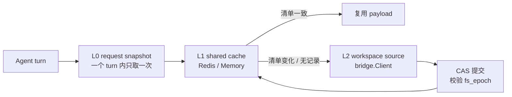

# Workspace Context Cache 设计与正确性要求

## 1. 这份文档想解决什么

每一次 Agent turn 在调用模型之前，都要先把工作区里那些会改变 Agent 行为的东西读出来：`AGENTS.md`、`MEMORY.md`、Hooks 配置、已启用的 Skills。这些文件很小，加起来通常只有几十 KB。但读它们要走 bridge gRPC，一个文件一次调用，一次 turn 下来是二十几个 round trip。在托管环境里，如果工作区还处于暂停状态，为了拼一段 prompt 而把整个 Sandbox 唤醒，代价就更离谱了。

[PR #881](https://github.com/memohai/memoh/pull/881) 是第一次尝试解决它，方向是对的：引入 request-scoped snapshot，把重复读取收敛成一次。它没做对的地方在于落地位置——把每轮的上下文正文、generation 和 refresh 状态写进 PostgreSQL 新表 `bot_workspace_context_snapshots`。热路径上的每一次缓存判定都变成一次数据库写，写入热度直接跟 Bot 的聊天热度绑定，热 Bot 会把这张表打成写热点。缓存本来是为了少做一次 IO，结果换来了一次更贵的 IO。

所以这份文档做三件事：

1. 把「什么结果才算正确」写在实现之前。少读几次文件不等于方案成立。
2. 记录两个我们在读代码时确认的坑。它们都能让一个看起来正确的缓存悄悄返回过期上下文，而且都不是靠加字段能绕过去的。
3. 划清阶段。现在能验证的部分先落地，还没接入的 provider 只留接口约定，不假装它已经存在。

本文中「必须」表示合入条件，「可以」表示实现自行选择，但选择之后的行为必须可观察、可测试。

如果你只读一节，读第 3 节。那里的两个问题不解决，后面所有协议都是白写的。

## 2. 范围

参与上下文拼装的来源，以及它们当前的读取位置：

| 来源 | 路径 | 当前读取点 |
| --- | --- | --- |
| System Files | `/data/AGENTS.md`、`MEMORY.md`、`PROFILES.md` | [fs.go:51](../../internal/agent/runtime/native/fs.go#L51) |
| Heartbeat 清单 | `/data/HEARTBEAT.md` | [service_trigger.go:150](../../internal/agent/application/service_trigger.go#L150) |
| 用户 Hooks | `/data/.memoh/hooks.json` | [service.go:58](../../internal/hooks/service.go#L58) |
| Plugin Hooks | `/data/.memoh/plugins/{id}/hooks.json` | [service.go:119](../../internal/hooks/service.go#L119) |
| Skills | 各 discovery root 下的 `SKILL.md` | [skills.go:206](../../internal/skills/skills.go#L206) |
| Plugin 启用状态 | PostgreSQL `bot_plugin_installations` | [service.go:127](../../internal/hooks/service.go#L127) |
| Workspace target | `bot_remote_runtime_bindings` 或本地容器 | [manager.go:267](../../internal/workspace/manager.go#L267) |

不在首版范围：任意工作区文件的通用缓存、工具执行结果、会话历史。只处理上面这张表。

顺手说一个当前状态：同一套 system files 的拼装逻辑现在有三份实现，分别在 [service.go:1230](../../internal/agent/application/service.go#L1230)、[acp_context.go:50](../../internal/agent/application/acp_context.go#L50) 和 [service_trigger.go:150](../../internal/agent/application/service_trigger.go#L150)。三份实现意味着「缓存路径和实时路径等价」这个断言没有唯一的比较对象。统一它们是缓存的前置条件，不是可选的清理项。

## 3. 两个必须先解决的问题

### 3.1 读路径自己在写工作区

`skills.ListWithPluginRoots` 每次被调用都会写回索引文件：

```go
// internal/skills/skills.go:206
func ListWithPluginRoots(ctx context.Context, client fileClient, ...) ([]Entry, error) {
	idx := readIndex(ctx, client)
	items := scan(ctx, client, DiscoveryRootsWithPluginRoots(rawCompatRoots, rawPluginRoots))
	resolved := resolve(items, idx.Overrides)
	writeIndex(ctx, client, idx.withItems(resolved))   // Mkdir + WriteRaw，每次读都写
	return resolved, nil
}
```

`writeIndex` 写的是 `/data/.memoh/skills/index.json`，而 `IndexDirPath` 本身就登记在 discovery roots 里：

```go
// internal/skills/skills.go:189
roots := []Root{
	{Path: ManagedDirPath, Kind: SourceKindManaged, Managed: true},
	{Path: IndexDirPath, Kind: SourceKindManaged, Managed: true},   // 读路径写进来的目录
	{Path: LegacyDirPath, Kind: SourceKindLegacy, Managed: false},
}
```

也就是说，读取上下文这件事会修改一个被登记为上下文来源的目录。任何直接对 discovery roots 做指纹的实现，都会看到清单每轮都在变，然后每轮都判定失效、每轮都重读。命中率不是偏低，是恒为零。而且它是静默的：日志里只会看到「来源变化，重新读取」，看起来完全正常。

`index.json` 里还带 `LastSeenAt` 时间戳，所以内容哈希也一样会变。

`hooks.Service.Load` 有同类行为，文件不存在时会写一份空配置（[service.go:69](../../internal/hooks/service.go#L69)）。影响比索引小，因为只在首次触发，但同样让「读取无副作用」这个前提不成立。

**WCC-FIX-001**：合入缓存之前，上下文读取路径必须不再写入工作区。

- Skills 的索引写入必须从读路径移出，只在显式的 Skill 变更操作（`ApplyAction`）里发生。
- 上下文读取必须有一条只读入口，并有测试断言它在整个调用过程中不产生任何 `WriteFile`、`WriteRaw`、`Mkdir`、`Rename` 或 `DeleteFile`。
- 如果某个状态文件确实需要在读时更新，它必须从 discovery roots 和清单里排除，并且排除理由要写在代码注释里。仅仅「记得排除」不够，需要断言。

这一条排在所有性能工作之前。它同时也是一个独立的性能修复：现在每次 prompt 组装都在往工作区写文件。

### 3.2 两个 Bot 可以共用一个文件系统

`bot_remote_runtime_bindings` 的唯一约束是 `UNIQUE (bot_id, runtime_id)`（[0001_init.up.sql:306](../../db/postgres/migrations/0001_init.up.sql#L306)）。约束的是「一个 Bot 不能重复绑同一个 Runtime」，不是「一个 Runtime 只能被一个 Bot 绑」。而 remote target 的工作目录直接取自连接握手：

```go
// internal/workspace/remote.go:251
DefaultWorkDir: connection.Info.WorkspaceBase,
```

所以 Bot A 和 Bot B 绑同一台 Remote Runtime 时，两者读的是同一个物理目录里的同一个 `AGENTS.md`。

PR #881 和上一版设计都按 `bot_id + workspace_target_id` 建缓存键。这个键下面藏着一个必然的失效漏洞：

```text
Bot A 的会话里改了 AGENTS.md
→ 失效 A 的缓存键
→ B 的缓存键没被碰过，仍然是 clean
→ B 的下一个 turn 用旧 AGENTS.md 拼 prompt
```

Remote Runtime 场景下还有更根本的一点：那是用户自己的机器。用户可以直接用编辑器改 `AGENTS.md`，Memoh 完全不在链路里。任何「所有写入都会经过我们、所以计数器足够」的假设，在这个 backend 上不成立。

**WCC-FIX-002**：失效必须按物理文件系统作用域，不能按逻辑 Bot 作用域。

引入 `fs_scope`，标识「同一份文件树」：

| Backend | `fs_scope` | 说明 |
| --- | --- | --- |
| 本地容器 | `container:{bot_id}` | 每个 Bot 独占容器，root 为 `/data` |
| Remote Runtime | `runtime:{runtime_id}:{workspace_base}` | 多个 Bot 可以共享，必须共享失效 |
| 未来托管 provider | `{provider}:{volume_or_sandbox_identity}` | 由 provider 适配层提供 |

`fs_scope` 由 workspace 层给出，不能由 Agent 层猜测。任何写入按 `fs_scope` 失效；组装结果按 Bot 存储，因为 Bot 的 plugin 启用状态和 prompt 配置不同。两级身份不能合并成一级。

## 4. 成本在哪里

上一版设计花了很大篇幅论证 `sha256sum` 能不能少传字节。我们认为这个方向抓错了。

上下文来源的总量很小。system files 的上限是 32 KB（`DefaultSystemFilesMaxBytes`，[config.go:14](../../internal/agent/runtime/native/config.go#L14)），单个 `SKILL.md` 通常是几 KB。真正贵的是 round trip 数量。按现在的实现数一遍：

```text
system files          3 × ReadFile
HEARTBEAT.md          1 × ReadFile
用户 hooks            1 × ReadRaw
plugin hooks          N_plugin × ReadRaw
skills 索引           1 × ReadRaw + 1 × Mkdir + 1 × WriteRaw
skills 发现           N_root × ListDir
skills 正文           N_skill × ReadRaw
```

10 个 Skill、3 个 Plugin、3 个 discovery root 的普通配置，一次 turn 就是二十多次串行 gRPC。在本地容器里每次可能只有 1 ms 量级，在跨网络的托管 runtime 上就是几十甚至上百毫秒的纯等待，而且是串行累加。

结论有两个，都跟上一版不一样：

**第一，v1 不需要 Exec，也不需要新的 helper 二进制。** 递归 `ListDir` 一次调用就能拿到整棵子树的 path、size、mode、mod_time：

```go
// internal/workspace/bridgesvc/server.go:229
if req.GetRecursive() {
	err := filepath.WalkDir(dir, func(p string, d fs.DirEntry, err error) error { ... })
}
```

每个 discovery root 一次递归 `ListDir` 就够做清单，不用起 Exec、不用拼 shell、不用给 helper 做版本管理、不用担心用户输入进命令行。上一版提议的 `FingerprintContextSources` 走 `find | sort | sha256sum`，引入的攻击面和运维负担都比它解决的问题大。

**第二，优化目标是「合并 round trip」，不是「压缩字节」。** 所以性能门槛应该写在调用次数上，这是能静态断言的，比 wall time 稳定得多。

代价要说清楚：`mod_time` 序列化成 RFC3339，只有秒级精度：

```go
// internal/workspace/bridgesvc/server.go:991
ModTime: info.ModTime().Format(time.RFC3339),
```

所以「size + mtime」判等有一个明确的盲区：同一秒内、大小不变的修改检测不到。这个盲区必须靠内容哈希覆盖，而不是靠「实际上很少发生」来回避。见 WCC-SNAP-003。

## 5. 分层读取



**L0：request-scoped snapshot。** 一个 turn 内只选定一次上下文，preflight、prompt 组装、Hooks 执行、Skills 解析都复用它。turn 执行期间发生的文件修改在下一个 turn 生效。PR #881 里这部分设计是对的，直接保留。

**L1：共享缓存。** 跨 turn、跨 Server 实例复用。存规范化来源、清单、组装结果和验证元数据。多实例部署用 Redis 或 Valkey，单实例 OSS 用进程内 backend。

**L2：权威来源。** 通过 `bridge.Client` 读工作区。只在无缓存、清单变化、来源无效重试，或者无法证明缓存有效时进入。

## 6. 缓存身份与状态

### 6.1 键

```text
payload key:  memoh:workspace_context:v1:{team_id}:{bot_id}:{target_id}:{schema_version}
epoch key:    memoh:workspace_context:v1:epoch:{fs_scope}
```

`schema_version` 覆盖缓存协议版本、清单编码规则和上下文组装规则。任何一项变化都必须提版本，让旧记录自然失效，而不是写迁移逻辑。

Redis key prefix 和配置结构对齐 Session Runtime 的既有形态（`memoh:session_runtime:`，[config.go:213](../../internal/config/config.go#L213)），但不复用它的 key schema、TTL 或 Lua 脚本。共用一套配置习惯，不共用一套数据。

### 6.2 epoch

`fs_epoch` 是每个 `fs_scope` 一个单调计数器，语义只有一句：**任何可能写入这个文件树的操作之前，先把它加一。**

顺序不能反。先推进 epoch 再写文件，那么即使 Server 在写成功之后、缓存更新之前崩溃，旧缓存也已经不是 clean 了。反过来先写文件再推进 epoch，中间崩溃就会留下一条「文件已变、缓存仍 clean」的记录，而且没有任何后续操作会去纠正它。

写操作失败可以留下一个保守的、偏紧的 epoch。下一次清单一致时自然恢复命中，不需要为失败路径回滚。回滚计数器带来的竞态比它省下的那次重读贵得多。

### 6.3 记录

```text
schema_version
fs_scope
payload
payload_hash
manifest              // 每个来源路径的存在状态、类型、大小、mtime、内容 SHA-256
manifest_digest
observed_epoch        // 建立这份 payload 时看到的 fs_epoch
writer_open           // 是否有无法证明已退出的写入者
verified_at
```

`manifest_digest` 和 `payload_hash` 是两件不同的事，不能互相替代。`manifest_digest` 哈希的是原始来源，用来判断文件有没有变。`payload_hash` 哈希的是规范化、解析、组装之后的结果，只用于诊断和测试。用 `TrimSpace` 之后的 payload hash 去判断来源是否变化，会把「文件改了但规范化后相同」和「文件没改」混成一种，从而漏掉真实变更。

`manifest` 保留每个路径的完整条目，这样清单变化后可以只重读新增和变更的文件，并删掉已消失的条目，而不是整体重读。

### 6.4 状态

- `missing`：没有可用记录。
- `verified`：本 turn 已确认清单与记录一致，可以复用。
- `stale`：记录存在但清单不一致，需要增量重读。
- `sealed`：文件系统已被 provider 冻结，且记录覆盖冻结前的最后一次变更，可以在不接触数据面的情况下复用。只对支持冻结语义的 provider 有意义，见第 9 节。
- `source_invalid`：权威来源本身有问题，例如用户 Hooks 无法解析。

### 6.5 running 状态下每个 turn 都要验证清单

这一点上我们和上一版设计的结论不同，值得说清楚理由。

上一版把 epoch 相等当作可以跳过验证的条件。在这个代码库里不成立：

- Remote Runtime 上文件系统是用户自己的机器，用户改文件不经过 Memoh，epoch 不会动。
- 容器里 Exec、Hooks 脚本、Browser Use 和 Display 会话都能写文件，其中一部分我们追踪不到。
- 缓存写入本身可能失败。

所以：**只要 `fs_scope` 处于活动状态，每个新 turn 都必须做一次清单快照。** epoch 在这里的作用是两个别的：epoch 已经变了时直接跳过验证、走重读（省一次调用）；以及作为 `sealed` 的判定门。

这个选择让 v1 完全不依赖任何 lifecycle 事件就能成立。命中的收益从「省掉一整轮读取」变成「一次清单调用替掉二十多次读取」，这已经是主要的那部分收益，而且今天就能测。

## 7. 失效协议

### WCC-MUT-001：已知写入

以下操作在调用工作区写入之前，必须先推进对应 `fs_scope` 的 epoch：

- `WriteFile`、`WriteRaw`、`Rename`、`DeleteFile`；
- Apply Patch；
- 文件上传、导入、备份恢复；
- Hooks 配置修改；
- Skill 安装、删除、启用、禁用；
- Plugin 安装、删除、启用、禁用；
- 工作区初始化和模板替换。

推进必须先于写入。理由见 6.2。

### WCC-MUT-002：Exec、PTY 与 Terminal

任何用户发起的 Exec、PTY 或 Terminal 都可能改文件，启动前必须推进 epoch。

上一版担心「为了验证缓存而使缓存失效」的循环。在这份设计里这个问题自动消失了：清单走 `ListDir`，不走 Exec，只读路径根本不碰失效逻辑。如果未来某个 provider 的清单实现确实需要 Exec，它必须走独立的、只允许内部调用的能力，并有测试断言它不推进 epoch。

### WCC-MUT-003：追踪不到的写入者

前台命令返回不等于它启动的所有进程都退出了。命令可以起 daemon、后台任务、watcher。

- 能证明相关进程树已经结束时，可以在下一次清单一致后清除 `writer_open`。
- 不能证明时，必须保留 `writer_open`。
- `writer_open` 为真的记录永远不能进入 `sealed`。

注意 `writer_open` 不影响 running 状态下的命中：那条路径每轮都重新验证清单，后台写入会在下一轮被看到。它只影响封存资格。首版可以保守，牺牲的只是封存命中率，换来的是不会静默用错上下文。后续可以用受控进程组或文件事件观察器收窄范围。

### WCC-MUT-004：非文件来源

Plugin 启用状态和 workspace target 选择不在文件里，文件哈希看不到它们。

这些变更必须推进同一个 epoch，或者提供一个同样参与 CAS 的控制面 revision。payload 只有在清单和控制面 revision 同时匹配时才能提交。

### WCC-MUT-005：失效写入是正确性屏障，不是尽力而为

如果当前 Server 无法确认 epoch 推进已经在共享 backend 生效，它必须选择以下之一：

1. 返回稳定、可重试的协调不可用错误，不执行工作区写入；
2. 先推进一个所有实例都会校验的持久 safety epoch，再执行写入。

进程内标记、异步补写、只打日志都不能替代这个屏障。否则会出现：

```text
epoch 推进失败（Redis 不可用）
→ 工作区文件写入成功
→ 其他实例的记录仍是 clean
→ 后续 turn 用旧上下文
```

这个 fail-closed 只针对可能留下「旧 clean 记录」的写操作。只读 turn 在 Redis 不可用时照常绕过缓存直读权威来源，不受影响。

### WCC-MUT-006：删除与重建

- Bot、workspace binding 或 volume 被删除时，必须异步清理对应的 payload key。清理失败不能阻塞权威资源删除。
- `fs_scope` 对应的文件系统被重建时（新容器、新 volume），必须先重新做清单，不能继承旧记录的验证状态。
- Remote Runtime 断连重连后 `workspace_base` 变化时，`fs_scope` 随之变化，旧记录自然不再被引用。

## 8. 清单

### WCC-SNAP-001：调用次数上界

一次清单快照的工作区调用次数，必须由「上下文来源的结构」决定，不能由文件数量决定。

具体门槛：`N_root + C`，其中 `N_root` 是 discovery root 数量，`C` 是一个不超过 4 的常数（固定文件目录 stat 等）。不允许出现 per-file 调用。

这一条可以用 fake client 计数直接断言，不依赖 benchmark 环境。它是主要的性能守卫。

### WCC-SNAP-002：来源集合必须完整

清单必须覆盖：

- 固定文件的存在、类型、大小、mtime、内容哈希；
- discovery roots 下新增、删除、修改的 `SKILL.md`；
- 已启用 Plugin 对应的 hooks 和 skills 文件；
- 影响发现结果的目录成员关系；
- 类型变化，例如普通文件变成目录或符号链接。

只对已有清单里的路径重新哈希是不完整的，它发现不了新增文件。

`ListDirAll` 目前传 `limit = 0`，服务端在这种情况下不截断（[server.go:281](../../internal/workspace/bridgesvc/server.go#L281)）。但 `ListDirResponse` 带 `truncated` 字段（[server.go:285](../../internal/workspace/bridgesvc/server.go#L285)），清单构建必须显式断言它为 false，而不是像 `scan()` 现在这样忽略。截断的清单会静默漏文件，而漏掉的文件表现为「这个 Skill 不存在」，很难从现象反查回来。

### WCC-SNAP-003：mtime 盲区必须由内容哈希覆盖

`mod_time` 只有秒级精度（第 4 节）。因此：

- 参与 prompt 或 Hooks 语义的文件，清单必须包含内容 SHA-256，不能只用 size + mtime。
- 只影响发现结果的目录条目，可以只用成员关系和类型。
- 内容哈希在哪些路径上省略，必须在代码里显式列出并说明理由。

### WCC-SNAP-004：编码必须确定

清单摘要的输入必须是确定性的：

- 路径按规范化后的绝对路径排序；
- 路径、类型、存在状态、大小、内容哈希用带长度前缀或 NUL 分隔的无歧义编码，不能用可能出现在文件名里的分隔符；
- 缺失的固定文件用明确 sentinel，「文件不存在」和「文件为空」必须得到不同摘要；
- 「目录不存在」和「空目录」必须得到不同摘要；
- 编码规则版本进 `schema_version`。

### WCC-SNAP-005：读取竞争

文件可能在清单和正文读取之间变化。建立或刷新记录时必须采用以下之一：

1. `snapshot → 读取变化文件 → snapshot`，两次摘要一致才提交；
2. 一个能同时返回一致清单和正文的原子能力，并说明它的一致性边界。

两次摘要不一致时做有界重试。超过预算后，本 turn 使用刚读到的内容作为 request snapshot，但不能把这个无法验证的结果提交成共享的 clean 记录。宁可下一轮再读一次。

### WCC-SNAP-006：读取失败不能被吞成空内容

这是一个当前就存在的问题，缓存会把它放大。

```go
// internal/agent/runtime/native/fs.go:44
func (f *FSClient) ReadTextSafe(ctx context.Context, path string) string {
	content, _ := f.ReadText(ctx, path)
	return content
}
```

`LoadSystemFiles` 用的就是它（[fs.go:61](../../internal/agent/runtime/native/fs.go#L61)）。一次瞬时读取失败会安静地产出空 `AGENTS.md`，Bot 当轮失去人格设定，日志里什么都看不到。

加上缓存之后，这个空结果会被提交成 clean 记录，然后一直复用到下一次来源变化。一次网络抖动变成一段持续的人格丢失。

要求：

- 上下文组装必须区分「文件不存在」和「读取失败」。
- 任何来源读取失败时，本次结果不能提交为 clean 记录。
- 「不存在」是一个正常的、可缓存的事实，必须在清单里有明确表示。
- 是否降级执行本轮 turn，是产品决定；但降级结果不能进共享缓存。

## 9. 冻结语义：给未来 provider 预留的端口

需要先说清楚：**这个代码库现在没有接入 E2B。** 没有 `provider_runtime_id`，没有 Runtime Worker，没有 Webhook Gateway，`bridge.proto` 里也没有 lifecycle 相关的东西。上一版设计有整整一节按这些组件已经存在来写，包括具体的签名算法和 webhook 路由类型。那部分不是设计，是对一个还不存在的系统的猜测。

所以这一节只定义端口的形状，标注清楚它未被验证，并且保证 v1 在没有它的情况下完整可用。

### WCC-SEAL-001：能力声明

支持冻结语义的 provider 必须实现：

```text
FreezeState(fs_scope) -> {
  frozen: bool,
  freeze_identity: string,   // 区分同一文件系统的不同运行周期
  frozen_at: timestamp,
}
```

不实现这个端口的 backend 一律走第 6.5 节的 running 路径。冻结只是可选优化，不是正确性的一部分。

### WCC-SEAL-002：封存条件

```text
record_exists
&& freeze.frozen
&& record.fs_scope == freeze.fs_scope
&& record.freeze_identity == freeze.freeze_identity
&& record.observed_epoch == current_epoch(fs_scope)
&& record.writer_open == false
```

`sealed` 必须从这些字段推导，不能存成一个可以被单独写错的布尔值。

「文件系统已冻结」只能证明冻结之后不会再变，不能证明冻结之前的最后一次写入已经进了记录。这是上一版设计里唯一最重要的判断，完全正确，保留。

### WCC-SEAL-003：封存路径不接触数据面

`sealed` 命中时不得调用 `ReadFile`、`ReadRaw`、`ListDir`、`Stat` 或 `Exec`。允许读共享缓存和 provider 的控制面状态。

冻结事件只能冻结缓存的有效性，不能刷新缓存内容。解冻不能立刻使 payload 失效（解冻瞬间文件系统和冻结时相同），但记录从那一刻起失去封存资格。

### WCC-SEAL-004：事件只是提示

如果 provider 通过 webhook 或类似机制推送冻结事件：

- 事件必须验签、幂等、持久化之后再向 provider 返回成功。
- 事件可能重复、延迟、乱序。判定必须比较 `freeze_identity` 和事件时间，不能按到达顺序覆盖。
- 事件只更新 observed 状态，不改 desired state。
- 无法确认顺序时，走 provider 的控制面查询对账，不能猜。
- 封存判定必须能在完全没收到事件的情况下工作：直接查 `FreezeState`。系统不能依赖「正常情况下总会收到事件」。

具体的签名算法、路由形态和 inbox schema，等 provider 真正接入时和它的实际文档一起定，现在写下来只会过期。

## 10. 正确性要求

### WCC-BASE-001：三条路径等价

同一组工作区来源和控制面状态下，以下路径必须产生等价上下文：

- 完整实时读取；
- 缓存命中并通过清单验证；
- `sealed` 命中。

等价范围包括 Hooks、Skills、System Files、Heartbeat 的内容、顺序、存在语义和解析错误。

这条要求隐含了第 2 节末尾提到的前置条件：三个拼装点必须先统一成一个，否则「等价」没有唯一的比较对象。

### WCC-BASE-002：请求内一致

同一 turn 的 preflight、prompt、Hooks 和 Skills 必须复用同一个 request snapshot。

不能出现 prompt 用旧 `AGENTS.md`、Hook 执行用新配置这种半新半旧的组合。这种不一致在日志里几乎看不出来，但会产生无法复现的行为。

### WCC-CACHE-001：共享与并发

多实例部署必须使用共享 backend。进程内 map 只能作为 request-local 或单实例 OSS backend。

多个实例同时刷新同一个键时，最多一个结果能提交到当前 epoch，较旧的刷新结果必须被 CAS 拒绝。

### WCC-CACHE-002：失败安全

- 缓存 miss、超时、重启、淘汰时，回退到权威来源。
- 记录无法解析时，删除或旁路它并重建。
- Redis 不可用时，不能用进程内旧副本冒充分布式 clean 记录。
- Redis 无法完成写前 epoch 推进时，遵守 WCC-MUT-005。
- 缓存错误可以产生降级日志和指标，但不能改变 Agent 上下文语义。

### WCC-CACHE-003：敏感数据

缓存里是用户工作区内容：

- 连接使用部署环境要求的认证和加密；
- key、日志、指标不含文件正文；
- 错误信息不输出 payload；
- 单记录大小上限和 TTL 可配置；
- `sealed` 表示逻辑上仍有效，不表示 Redis 必须永久保存这条记录。

### WCC-DB-001：不进 PostgreSQL 热路径

以下数据不能写入 PostgreSQL：

- 每轮的上下文 payload；
- 清单；
- 每次清单快照的结果；
- epoch 的逐 turn 更新；
- 为缓存命中产生的 refresh 状态。

PostgreSQL 继续保存本来就该持久化的东西：workspace binding、Bot 和 Plugin 配置、provider 的 observed lifecycle。

不要为了「Redis 重启后保住命中率」加一层 PostgreSQL fallback。Redis 丢了之后的正确行为就是重读来源，成本是一次 turn 的延迟，不是正确性问题。用一个写热点去换这个，账算不过来。

### WCC-DEP-001：部署边界

- 单实例 OSS 默认用 memory backend，不强制 Redis 或 Valkey。
- 多实例启用共享 backend，启动时验证配置。缺依赖时拒绝进入多实例模式，不能退化成几个互不知情的进程内缓存。这个校验逻辑和 Session Runtime 现有的做法对齐（[config.go:358](../../internal/config/config.go#L358)）。
- 不支持冻结语义的 backend 仍可使用 running 缓存。

## 11. 性能要求

### WCC-PERF-001：调用次数

- 清单快照的调用次数满足 WCC-SNAP-001 的 `N_root + C` 上界，用 fake client 计数断言。
- 命中时的工作区调用次数必须严格小于完整读取。用同一个 fake client 在同一份 fixture 上对比两条路径。

先卡住调用次数，因为它是可以静态断言、不会因为环境波动而 flaky 的。wall time 门槛留给真实环境验证，不作为单元测试的门槛。

### WCC-PERF-002：写放大

一次普通 model-only turn：

- PostgreSQL 的 context-cache 写入为 0；
- 共享缓存最多一次读 + 一次有条件 CAS；
- 清单一致时不重写完整 payload，只更新必要的验证元数据，或者完全不写；
- 工作区写入为 0（这是 WCC-FIX-001 的可观测形式）。

### WCC-PERF-003：真实环境验证

在真实的跨网络 runtime 上比较：

1. 当前逐文件读取；
2. 清单命中；
3. 清单变化后的增量读取；
4. 单次批量完整读取（作为对照，确认清单方案真的更快）。

数据集覆盖：固定文件为主的小上下文、常见 Skill 数量、P95 文件数和总字节、单文件变化、文件新增删除、全量变化。

每组记录 P50/P95/P99 wall time、工作区调用次数、上下行字节、缓存后端耗时、命中率、误失效率。

如果清单路径的 unchanged-hit 没有明显快于单次批量完整读取，就直接用批量完整读取，不要为了保住清单方案而接受更慢的热路径。方案是为了省时间存在的，不是反过来。

### WCC-PERF-004：封存命中

`sealed` 命中必须单独记录：命中计数、是否发生控制面对账、是否意外触发解冻。验收中意外解冻次数必须为 0。

## 12. 故障与恢复

**共享缓存不可用。** 活动状态下完整读取来源，得到 request snapshot，缓存写入失败不影响本轮。已冻结状态下没有可证明有效的记录时，允许解冻后读取，不能猜旧记录仍然有效。恢复后由下一次 turn 自然重建，不需要回填任务。

**Server 崩溃。** 写前已经推进 epoch，所以写后崩溃不会留下 clean 的旧记录。刷新结果通过 CAS 提交，未提交的结果被丢弃。其他实例继续从共享缓存和权威来源恢复。

**provider 事件延迟或丢失。** 定期对账纠正 observed 状态。本地认为活动、provider 实际已冻结时，不能因为一次清单调用失败就把旧记录当有效。本地认为已冻结但 `freeze_identity` 确认不了时，不封存。

**文件系统被替换。** 新容器或新 volume 意味着新的 `fs_scope` 或新的 `freeze_identity`，必须重新做清单，不继承旧的验证状态。

## 13. 实施顺序

### Phase 0：前置修复

1. 把 skills 索引写入从读路径移出，加只读断言（WCC-FIX-001）。
2. 引入 `fs_scope`，由 workspace 层提供（WCC-FIX-002）。
3. 统一三个上下文拼装点。
4. 区分「不存在」和「读取失败」，去掉静默吞错（WCC-SNAP-006）。
5. 记录当前的调用次数和延迟基线。

这个阶段不引入任何缓存，但每一项单独都是修复。它也是唯一必须先做完的阶段。

### Phase 1：清单与 request snapshot

1. 抽出 `WorkspaceContextSource` 端口，用递归 `ListDir` 实现清单。
2. 实现 request-scoped snapshot，复用 PR #881 里这部分设计。
3. 补齐新增、删除、类型变化、竞争读取的测试。
4. 断言 WCC-SNAP-001 的调用次数上界。

做完这一阶段，即使还没有共享缓存，单个 turn 内的重复读取已经消除。

### Phase 2：共享缓存

1. 抽出 `WorkspaceContextCache` 端口。
2. 实现 memory 和 Redis/Valkey 两个 backend，配置结构对齐 Session Runtime。
3. 接入 epoch、CAS 和所有已知写入口。
4. 双实例验收：并发刷新、共享 FS 失效、backend 故障。

### Phase 3：冻结语义

等到真的有一个 provider 需要它的时候再做。届时按第 9 节的端口形状实现，并用那个 provider 的实际文档确定事件细节。

### 和 PR #881 的关系

保留：request-scoped snapshot 的设计、纯扫描和清单的思路、用户 Hooks 配置无效时 fail closed 的判断、以及那个 inject channel 双 close 的 panic 修复。最后一项和缓存无关，应该拆成独立 PR 先合。

不合入：`bot_workspace_context_snapshots` 表、对应的 migration 和 query、以及每轮 generation 的 PostgreSQL 写入。

## 14. 验收

### 14.1 算法测试

清单编码、封存判定、epoch 与 CAS、清单 diff、来源规范化、缓存编解码与 TTL、request snapshot、重复与乱序事件。可以用 fake clock、memory backend 和 fake workspace client。

调用次数断言放在这一层，用计数型 fake client。

### 14.2 集成测试

清单实现的正确性、前台与后台 Exec 的 `writer_open` 行为、只读路径不产生工作区写入、共享 `fs_scope` 下的跨 Bot 失效。

### 14.3 黑盒验收

真实 Server 进程、真实 Redis 或 Valkey、真实 PostgreSQL（断言 context cache 不产生写入）、两个共享 backend 的实例、可控模型服务。turn 必须从公开聊天入口发起，不能直接调用缓存服务。

### 14.4 场景

| 场景 | 初始状态 | 断言 | 对应要求 |
| --- | --- | --- | --- |
| read is read-only | 任意 | 一次上下文读取产生 0 次工作区写入 | WCC-FIX-001 |
| shared fs invalidation | 两个 Bot 绑同一 Runtime | 经 A 改文件后，B 的下一 turn 看到新内容 | WCC-FIX-002 |
| baseline miss | 无记录 | 完整读取一次并建立记录，上下文正确 | WCC-BASE-001 |
| hot unchanged | 有记录，来源未变 | 一次清单调用，不重读正文 | WCC-SNAP-001、WCC-PERF-001 |
| hot changed | 改 `AGENTS.md` | 下一 turn 用新内容，且只重读变化文件 | WCC-MUT-001 |
| same-second edit | 同秒内改动且大小不变 | 内容哈希检出变化 | WCC-SNAP-003 |
| skill added | 新增 `SKILL.md` | 清单检出新增 | WCC-SNAP-002 |
| skill deleted | 删除 `SKILL.md` | 缓存不再暴露该 Skill | WCC-SNAP-002 |
| read failure | 注入读取失败 | 不提交 clean 记录，也不缓存空内容 | WCC-SNAP-006 |
| concurrent refresh | 两实例同时刷新 | 旧 epoch 的结果被 CAS 拒绝 | WCC-CACHE-001 |
| epoch write fails | Redis 写入失败时发起文件写 | fail closed，不执行写入或先推进持久 epoch | WCC-MUT-005 |
| backend restart | 热路径中清空 Redis | 不使用旧进程内副本，自动重建 | WCC-CACHE-002 |
| fs replaced | 新容器挂同一份数据 | 不继承旧验证状态，先重新做清单 | WCC-MUT-006 |
| PostgreSQL audit | 连续 model-only turn | context-cache 的 PostgreSQL 写入为 0 | WCC-DB-001 |
| source invalid | Hooks 语法错误 | 缓存路径和实时路径返回相同的稳定错误 | WCC-BASE-001 |
| sealed hit | 支持冻结的 provider | 不接触数据面，不意外解冻 | WCC-SEAL-003 |
| sealed dirty | 改动未验证即冻结 | 不封存，解冻后重读 | WCC-SEAL-002 |
| background writer | Exec 起后台写入后冻结 | `writer_open` 记录不得封存 | WCC-MUT-003 |

最后三个场景需要一个支持冻结语义的 provider，跟 Phase 3 一起做。前面的场景在当前代码库上就能跑。

## 15. 通过标准

Workspace Context Cache 可以替代 PR #881 的方案，需要同时满足：

1. Phase 0 的前置修复已合入，并有断言守住：读路径不写工作区、`fs_scope` 已接入、拼装点已统一、读取失败不再被吞成空内容。
2. 本文所有「必须」项有对应实现，或有明确排除的部署边界。
3. 缓存命中和完整读取产生等价上下文，包括错误路径。
4. 共享文件系统场景下，一个 Bot 的写入会让其他绑同一 `fs_scope` 的 Bot 失效。
5. 清单快照的工作区调用次数由结构而非文件数决定，有测试断言。
6. 双实例验收证明 CAS 能阻止旧刷新覆盖新结果。
7. Redis 或工作区故障只造成可观察的 miss 和降级，不造成错误命中。
8. 连续 model-only turn 的 PostgreSQL context-cache 写入为 0。
9. 默认单实例 OSS 配置不强制依赖 Redis、Valkey 或任何托管 provider。
10. 真实环境 benchmark 证明清单热路径确实更快；否则改用经验证更快的批量读取路径。

第 9 节的冻结语义不在通过标准里。它是一个可选优化，等到有 provider 需要时再验收。
